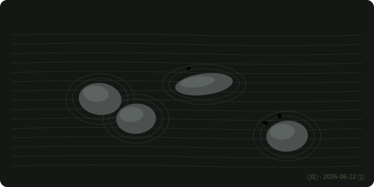

<div align="center">

# `na`

### 無から生まれた、小さな作品集 — *small works, born from nothing*

[](https://github.com/sm06224/na/actions/workflows/gitleaks.yml)
[](https://github.com/sm06224/na/actions/workflows/test.yml)
[](./LICENSE)

**無 → 庭 → 生 → 史 → 番 → 言 → 歌 → 備 → 奏 → 苔 → 織 → 算 → 針 → 狐 → 星 → 雷 → 陽 → 割 → 窟 → 種 → 籤 → 波 → 陣 → 層 → 雪 → 響 → 段 → 宙 → 声 → 碑 → 証 → 影 → 計 → 謎 → 反 → 興 → 儚 → 斑**

</div>

---

`README.md` に「na」とだけ書かれた空のリポジトリから始まりました。
そこを出発点に、*無から何かを生み出す* というテーマで作品を増やしています。
すべて **依存パッケージはゼロ**。クローンしてブラウザで開けば動きます。

## 作品

### 🌸 [庭 `garden`](./works/garden/) — *a generative ambient garden*
触れると流れ、待てば咲く。自前のノイズで作る流れ場を光の粒が走る、瞑想的なジェネラティブアート。
Web Audio によるペンタトニックの環境音つき。**1 ファイル**で完結。

### 🌍 [生 `sei`](./works/genesis/) — *a world that evolves without you*
あなたの意思が介在しない人工生命の世界。**神経回路の脳**を持つ生き物たちが食べ、増え、
写し間違い（変異し）、**種に分かれ、滅びていく**。学習はせず、進化だけが賢さを選び取る。
個体をクリックすると遺伝子と**脳の発火がライブで**見え、世界は JSON に保存・復元できる。
シミュレーションコアは DOM 非依存で、**Node でヘッドレス・テスト**される（16 tests）。

### 📜 [史 `shi`](./works/shi/) — *a history that writes itself*
ひとりでに書かれてゆく歴史書。種から大陸・川・気候が生まれ、集落が興り、**王が立ち、
国が領土を塗り広げる**。街道は **A\* 経路探索**で結ばれ、国境の摩擦は戦争に、交易は富と
**疫病の伝播**になる。文明は石器から中世へ時代を進み、すべての出来事は固有名つきで
**史書**に刻まれる（「全史の間」で通史が読める）。コアは DOM 非依存・15 tests。
1200 年のヘッドレス検証では 239 の戦争、85 の反乱、87 の国の滅亡が記録された。

### 🗓 [番 `ban`](./works/ban/) — *シフト表は、ブラウザだけで*
作品集で唯一の**実用ツール**。シフト作成者の過半数が「時間がかかりすぎ」と答える
毎月の苦行を、**焼きなまし法ソルバ**が数秒で終わらせる。勤務間インターバル 11h・
連勤上限・夜勤回数という**公的ガイドライン準拠のルール**を自動チェックし、
土日・夜勤の偏りを均す。無料・登録不要・**データは端末から一歩も出ない**。
Excel 対応 CSV／iCal／印刷／PWA（オフライン動作）。コアは DOM 非依存・**49 tests**。

### 🗣 [言 `koto`](./works/koto/) — *a language that invents itself*
**無から言葉が生まれる**世界。群れが音をさぐり、通じた音だけが約束になる。単語は発生し、
訛り、**方言に分かれ**、意味がずれ、死語になる。よく通じ合う群は栄え、通じない群は縮む——
**言語が生存と結びついている**。群をクリックすると**勝手に書かれた辞書**が読め、語の誕生・
意味の変化・借用が言語史に刻まれる。誰も設計しない言語を眺める。コアは DOM 非依存・**20 tests**。

### 🎵 [歌 `uta`](./works/uta/) — *music that composes itself*
**無から音楽が生まれる**世界。胸に残った節だけが、もう一度歌われる。歌は変奏され、
**覚えやすい歌ほど生き残る**——この淘汰圧だけで、誰も教えていないのに**フック（サビ）が
創発する**。分派の創始者効果が節回しの方言を生み、覚えやすい歌ほど群れを越えて**流行**する。
そして Web Audio で**この世界の歌が実際に聴こえる**（五音音階なので、どの歌が重なっても
協和する）。出力が「言葉」だった系譜が、ここで「音」になる。コアは DOM 非依存・**24 tests**。

### 🎒 [備 `sonae`](./works/sonae/) — *我が家の備蓄は、三分でわかる*
二番目の**実用ツール**。家族構成（乳幼児・高齢者・ペット・生理用品まで）と日数を入れると、
**公的な目安に基づく約30品目の備蓄リスト**が数量つきで出る。チェックすると備え率が見え、
**冷蔵庫に貼れる A4 チェックリスト**として印刷できる。無料・登録不要・オフラインで動き、
**データは端末から一歩も出ない**。根拠は農水省・東京備蓄ナビ・環境省。コアは DOM 非依存・**17 tests**。

### 🎐 [奏 `kanade`](./works/kanade/) — *みんなで触れる、光の楽器*
ひとつの画面に**何本でも指を**。スマホを輪の真ん中に置けば、その場の全員で合奏できる。
使える音を**半音のない五音音階**に量子化してあるので、**誰がでたらめに触っても濁らない**
（この約束はテストが守る）。弾いた音と光は**8 秒後に薄くなって還ってくる**（こだま）ので、
ひとりでも重ね録りの合奏になる。残響はノイズから手作り。音源ファイルなし・サーバーなし。
`庭` と `歌` の血を引く、あなたたちが鳴らす楽器。コアは DOM 非依存・**12 tests**。

### 🪨 [苔 `koke`](./works/koke/) — *moss grows over this repository*
作品集で唯一、**開いても動かない**作品。時間がたつと変わる作品。毎週月曜の朝、
CI の庭師がひとりでに目を覚まし、石庭の SVG に苔をすこし描き足して、**自分でコミットして帰る**。
庭は状態を持たず**週番号の純粋関数**なので、庭師が何週眠っても苔は経った時間ぶん育つ。
そして第8週・第26週・第52週……**歳月だけが連れてくる客**が、コードの中で待っている。**7 tests**。

### 🧵 [織 `ori`](./works/ori/) — *cloth woven from song*
**歌を布に織る織り機**。旋律の高さが組織（経糸の浮き沈みの規則＝セルオートマトン）を選び、
長さが緯糸の段数になり、高さは草木染めの色になる——だから**歌のフックが、目に見える柄になる**。
カナ譜の文法は `歌` と同じなので、**あちらの世界で生まれた節をそのまま織って持ち帰れる**。
布の丈が満ちるまで歌はリピートされるが、組織の状態は繰り返しを越えて流れるので、
同じ色の帯が巡っても織り味は二度と同じにならない。出力の系譜は「言葉 → 音 → **紋様**」へ。
織り上がりには**銘**（決定的な指紋）がつき、SVG で持ち帰れる。コアは DOM 非依存・**12 tests**。

### 🖥 [算 `san`](./works/san/) — *a computer born from nothing*
作品集でいちばん大きな作品。**無から作った計算機**——ブラウザに住む架空の 16bit コンソール。
自作の CPU（独自命令セット）・アセンブラ・**日本語キーワードの高級言語「珠」とそのコンパイラ**・
128×96・16色の画面・4チャンネル音源・**ステップ実行とブレークポイントを持つデバッガ**まで、
すべて依存ゼロで一そろい。仕様書（[HARDWARE.md](./works/san/HARDWARE.md)・
[LANGUAGE.md](./works/san/LANGUAGE.md)）が機械の唯一の真実。同梱 ROM では**蛍が機械の中で
もう一度光り**、へびが遊べ、電卓がシリアル越しに答え、珠で書かれた「恋歌」が
あの節を機械の声で歌う。コアは DOM 非依存・**105 tests**。

### 🧭 [針 `hari`](./works/hari/) — *a needle that remembers the way back*
三番目の**実用ツール**、そして**スマホでこそ**の一品。駐車場・フェスのテント・宿に
ワンタップで針を刺せば、あとは**矢印と距離だけ**が連れ戻す。地図を出さない設計だから
**完全オフライン**——電波のない立体駐車場や山でいちばん効く。GPS は精度加重平均で刺し、
磁気センサーの磁北は**国土地理院の偏角近似式で真北に補正**、🔔を入れると**正しい方向ほど
速く脈打つ振動**で画面を見ずに歩ける。座標を URL に畳んだリンクを送れば、相手はブラウザで
開くだけの**サーバーなし待ち合わせ**。登録なし・**場所は端末から出ない**・PWA。
コアは DOM 非依存・**29 tests**。

### 🦊 [狐 `kitsune`](./works/kitsune/) — *a GPS treasure hunt*
`針` から生まれた、**スマホひとつで遊ぶ宝探し**。**狐（出題者）**が街を歩いて的を仕掛け、
名前・ヒント・通過方法を添えて**コースまるごとを一本のリンクに畳む**。**追手**はそれを開くだけ、
針と同じ**矢印**で次の的へ駆ける——地図は出ないから、知っている街も迷宮になる。
通過のしるしは三つ：📍**GPS**（輪に入れば自動）・🔳**QR**（現地に貼った QR を標準カメラで。
**コードは依存ゼロで自作**）・📷**写真**（その場の一枚が証明であり思い出）。QR が運ぶのは
答えの**ハッシュだけ**だからリンクを解読してもズルできず、順番も飛ばせない。
**サーバーは一台もない**——コースも進行も写真も端末から出ない。コアは DOM 非依存・**24 tests**。

### ★ [星 `hoshi`](./works/hoshi/) — *a sky that names itself*
**誰も設計しない夜空**。種ひとつから 600 の星が撒かれ、明るい星は近ければ
**おのずと結ばれて星座になり**（最小全域木で枝を張る）、**自分で名のり**、かたちと
主星の色から**由来＝神話が書かれる**。`言`・`歌`・`史` と続いた「ひとりでに名づけ、
物語る」系譜の、夜の章。すべては種の純粋関数だから、**同じ種からは一星も一文字も
ちがわない同じ空**——リンク（`#s=種`）で誰かと同じ夜を見上げられる。空でいちばん
明るい**一番星**が最初に灯り、その由来は次に来る人への言づてになっている。
コアは DOM 非依存・**9 tests**。

### ⚡ [雷 `kaminari`](./works/kaminari/) — *lightning that finds its own way down*
`星` の対、**割れる空**。上辺の雲から下辺の地へ電位の場が張り、稲妻の先端は
**ひらいた野＝電位の高いほうへ確率的に伸びる**——一マス進むたびに**ラプラス方程式を
解き直す**、本物の**誘電破壊モデル**（dielectric breakdown）。誰も枝を描かないのに、
幹と枝とフラクタルが種ひとつから決まる。`生`（神経）・`史`（経路探索）・`星`（最小全域木）
と続いた「**場の自己組織化が形を生む**」系譜の、嵐の章。やがて地に届くと**落雷点**が決まり、
稲妻は**おのれの名を名のり**、枝ぶりと落ちどころから物語が書かれる。閃光のあと、**雷鳴は
光より遅れて届く**（雑音から手作り）。同じ種からは一閃も違わない同じ稲妻——リンクで渡せる。
コアは DOM 非依存・**10 tests**。

### ☀ [陽 `hinata`](./works/hinata/) — *where, when, and how much sun*
**四番目の実用品**。緯度経度と日付を入れると、その地の太陽が読める——日の出・南中・日の入り、
昼の長さ・南中高度、市民／航海／天文の**薄明**、写真の**ゴールデンアワー**、そして太陽の**通り道**を
方位×高度のドームに描く。核心は**窓の日当たり**：窓の向きと、目の前をふさぐ高さ（隣家・山）を
入れると、その窓に**直射が入る時間帯と合計**、さらに**通年（毎月）の日当たり時間**が出る。
南向きの窓がいつも一番とは限らない——夏の真南窓はむしろ直射が短い、といった「計算でしか
わからない日当たり」を見せる。`針` と同じ球面の数学（NOAA Solar Calculator の式）で、東京の実測と
**分単位で一致**。位置も日付も**端末から一歩も出ない**（リンクに畳むだけ）・無料・オフライン。
コアは DOM 非依存・**17 tests**。

### 💴 [割 `wari`](./works/wari/) — *budget then settle, in one place*
**五番目の実用品**。イベント幹事のお金は二度こまる——前は「会費いくら集める？」、後は「立て替えを
どう精算？」。`割` は両方を引き受ける。**計画**は、**人数割（×人数）**の料理代と**一式（1回きり）**の
会場代・花代を足し、**主賓は無料**でその分を**みんなで肩代わり**（送別会）して、集めやすい額に切り上げた
**一人あたりの会費**と集金・余りを出す（名前なし・**頭数だけ**でも可）。**実績**は、出費を**事前/当日/事後**
の表に「項目・払った人・金額」で積み（払い手未定の行は予定として精算に入らない）、メモ・領収書写真・
**傾斜**・支払い済みチェックつきで、最後に**最小の送金**へ再分配——「**A → B に ¥X**」とそのまま実行
できる答えを出す。割り勘アプリと違い**登録なし・サーバーなし・お金も領収書も端末から出ない**。
コアは DOM 非依存・**19 tests**。

### 窟 [窟 `kutsu`](./works/kutsu/) — *a labyrinth no one designs*
**種ひとつから一揃いのローグライクが生まれる**。部屋＋通路・セルオートマトンの洞窟・BSP・迷路が
深さに応じて選ばれ、繋がれ、扉・罠・水・像・階段が据えられ、深さ帯ごとの魔物（50体超・群れ・遠隔・
呪文・盗み・擬態・ヌシ）と宝（80種超の武器/防具/薬/巻物/杖/指輪/食料）が湧く。青い薬が回復とは
限らない——**未鑑定の見た目は潜行ごとに種で入れ替わる**。視界はシャドウキャスト、魔物は**匂い
（ダイクストラ地図）**を下って寄り、戦いは命中＝腕対身のこなし・傷＝さいころ＋力−鎧。死ねば
**墓碑銘**が立つ（`史` の血を引く年代記）。`生`・`史`・`星` と続く「ひとりでに生まれる」系譜の地の底の章で、
**同じ種からは一マスもちがわない同じ迷宮**——`#s=種` で渡せる。コアは DOM 非依存・**56 tests**。

### 🌱 [種 `tane`](./works/tane/) — *plants grown from a seed*
**種ひとつから、草木がひとりでに芽ぐむ**。誰も枝ぶりを描かない。一文字の書き換え規則
（**L-システム**）が種からほどけるように同じ文字を書き換えつづけ、**亀（タートル）**がそれを
なぞって茎になり、枝を分け、葉をひらく。育つ向きは**重力と陽（ホンダの屈性）**がそっと曲げる——
だから垂れる木も、すらりと伸びる草もある。品種は決め打ちせず、**立ってみたその影で**草姿
（枝垂れ・すらり・横這い・こんもり・ふさ・叢）を名づける。種から決まる**四季**で葉のいろと
花の数が変わり、草木は芽のうちに**おのれの名を名のる**。種は二重の意味を負う——**乱数の種であり、
土に蒔く種**でもある。`#s=種` で渡せて、**同じ種からは葉の一枚までちがわぬ同じ草木**が立つ。
`庭`・`星`・`雷`・`窟` と続く「ひとりでに生まれる」系譜の、芽ぐむ章。コアは DOM 非依存・**11 tests**。

### 🎲 [籤 `kuji`](./works/kuji/) — *a draw no one can rig, that anyone can verify*
六番目の**実用ツール**。当番・席替え・順番決め・プレゼント抽選——みんな幹事を**信じるしかない**。
籤は、くじの結果を**参加者・モード・塩（種）だけの純粋関数**にし、手づくりの **SHA-256**（既知の
テストベクトルと一字一句照合）で封をする。引く側は結果より先に**封（commitment＝塩のハッシュ）**を
配る——あとから塩を選び直しても封と合わず、**結果は書き換えられない**。受け取った人は「証拠」を
開けば、いつ誰が計算しても同じ並びが出ることを**自分の目で確かめられ**、身内びいきが無いとわかる。
洗牌は剰余の偏りを棄却法で除いた**偏りなしのフィッシャー–イェーツ**（5人×6000回でも各席ほぼ均等、
テストが守る）。さらに**みんなの合言葉**を混ぜれば、引く側ですら結果を予見できない。順番・抽選・
組分けに対応し、登録なし・サーバーなし・**くじも名前も端末から出ない**。`星`・`雷`・`窟`・`種` と続く
「**同じ種からは同じ結果**」を、芸術から**信頼の道具**へ。コアは DOM 非依存・**15 tests**。

### 🌊 [波 `nami`](./works/nami/) — *a pond you can touch*
**触れると生まれ、ひろがり、岸で跳ね返り、重なって、しずまる水面**。誰も波形を描かない——
水面の高さを格子に持ち、離散化した**波動方程式**（`h' = 2h − h_prev + c²∇²h`）を一歩ずつ進めるだけ。
岸は反射壁だから波紋は縁で跳ね返り、互いに**干渉**する。傾きが空のグラデを**屈折**させて光の帯
（caustics）になり、稜が**きらめく**。**長く押すほど大きく深い波**、なぞれば航跡、**待てば雨**。
一雫ごとに、雑音と発振から手づくりの水音が鳴り（大波ほど低く深く）、自前のリバーブで池に**響く**。
`庭`・`蛍` と続く、理屈はさておき**ただ触れて眺める**ための一作。コアは DOM 非依存で、対称性・
安定性・減衰・重ね合わせ（線形性）・**大波でも壊れないこと**を**ヘッドレス検証**・**9 tests**。

### ⚔ [陣 `jin`](./works/jin/) — *a tactics RPG born from a seed*
**種ひとつから、盤上の戦記がまるごと生まれる**タクティクスRPG。タッチで指揮する。
グリッド戦闘・**A\* 移動**・命中/会心/**連撃**・**三すくみ**（剣>斧>槍）と魔法の三色・**地形効果**
（森は回避、山は固く、砦は癒す）・職と技（**太陽・月光・流星・瞬殺**…）・経験と**上級転職**・
持物と杖・**敵 AI**（到達×標的を評価し最善を選ぶ）。戦場も敵もボスも、自前のバリューノイズと
乱数から**決定的に**組まれ、**同じ種からは一マスもちがわぬ同じ戦記**——`#s=種` で渡せる。
`生`（神経）・`史`（経路）・`窟`（迷宮）と続く「ひとりでに生まれる」系譜の、戦の章。
**魔物図鑑・世界史・支援会話・章ごとの物語**、手作りの**設置マップ**、そして**自前のチップチューン**
（波形から作る BGM 11 曲：表題・各地の戦・ボス・凱歌…）も携える。コアは DOM 非依存で、
経路・戦闘・AI・生成・全章の決着・内容/楽譜/演出/保存の健全性までを**ヘッドレス検証**・**54 tests**。
**全16章の二幕構成**（簒奪王の裏に潜む「禁書の声」と古竜）・章で**加わる仲間**・駒の描き分け・
**斬撃/矢/魔法/火花**の演出・**BGM 11曲**・章のあいだの**店/編成/転職/セーブ**つき。約 7,000 行。
（目標二万行の大作のため、なお登りつづける。）

### ⛰ [層 `sou`](./works/sou/) — *a year becomes a layer; a cliff remembers*
**種ひとつから、地の記憶を積む**。一年に一枚、地層が降り積もる——**雨の年は厚く粗く**（礫・砂）、
**乾いた年は薄く細かい**（泥・粘土）。気候はいくつかの正弦波の重ね合わせで、まれな**大水・火山灰・
旱魃・地震・繁茂**が、ひと筋の際立った縞となって残る。積もった層は**己の上に載る重みで圧密**され、
下の古い層ほど薄く締まる。やがて**侵食が崖を切る**と、地表（今）から岩盤（最古）まで、深い時間が
そのまま縞の重なりとして立ちあらわれる。`蛍`・`波` と同じく、理屈はコアにあり画面には静けさだけ。
縞に触れれば、その年と粒度がわかる。同じ種なら寸分たがわぬ同じ大地。コアは DOM 非依存・**8 tests**。

### ❄ [雪 `yuki`](./works/yuki/) — *a snowflake is a letter from the sky*
**種ひとつから、空の手紙を一片おろす**。その日の**空——温度と湿り**——が**晶癖**（角板・扇板・星形・
樹枝・羊歯状）を決め、水蒸気が**ライター(Reiter)の六方格子セルオートマトン**で結晶のふちに凍りつく。
**誰も形を描かない**——乱数は形に触れず、種が選ぶのは「その日の空」だけ。規則がほどけるだけで、
おのずと**六方の華**になる（この**六回対称は、コアが六方の和を整列して足すことでビット単位で保証**し、
テストが見張る）。結晶は**おのれの名を名のり、空からの手紙を綴る**——`中谷宇吉郎`の言うとおり、
**雪は天から送られた手紙である**。同じ種なら寸分たがわぬ同じひとひら（`#s=種` で渡せる）——けれど、
世に二つと同じ雪はない。`生`・`星`・`雷`・`種` と続く「**ひとりでに生まれる**」系譜の、冬の章。
コアは DOM 非依存で、決定性・**六回対称**・成長の単調・連結性・健全性まで**ヘッドレス検証**・**11 tests**。

### 響 [響 `hibiki`](./works/hibiki/) — *resonance born from nothing*
**無から生まれる、響き**。種ひとつから、**共鳴する物体**（鐘・うたう鉢・硝子・木・石・銅鑼…）を鋳る。
**材質が倍音の非調和性と減衰を、寸法が音高を決める**。叩けば、サンプル音源を一切使わず、**減衰する
正弦波の重ね合わせ**（**モーダル合成**、源は物理そのもの）で生きた音色が鳴って消える——鐘には
**短三度の唸り**、うたう鉢には永い余韻、木と石には短い沈み。音高はすべて**五音音階に量子化**され、
**どの物が同時に鳴っても濁らない**（`奏` から継ぐ約束で、テストが守る）。残響はノイズから手作り。
風を入れれば、**目を閉じても**ときおりそっと鳴る。`庭`・`奏`・`波` と続く音の系譜の、旋律ではなく
**音そのもの**——一つの物が鳴って消えるまでを聴く章。同じ種なら寸分たがわぬ同じ響き（`#s=種` で
渡せる）。コアは DOM も Web Audio も知らず、五音の協和・倍音の健全・材質の永さの序列・**波形が
無クリップで頭で鳴り尾で消えること**まで**ヘッドレス検証**・**9 tests**。

### 段 [段取り `dandori`](./works/dandori/) — *get every dish hot at once*
作品集の**実用ツール**。夕食づくりの難所は、味でも手順でもなく**「全部いっせいに、熱いうちに出す」**こと。
料理を選び、**配膳の時刻**と、あなたの**台所**（人数・こんろの口数・オーブンの台数）を入れると、
**何時に始めて何時に何をするか**を配膳から**逆算**して返す。**あなたの手は同時に一つ**、こんろもオーブンも
数まで——という制約を必ず守り（だから「二か所を同時に」とは言われない）、**傷みやすい品ほど配膳ぎわ**に置く。
炊飯・煮込み・蒸らしのような**放っておける時間**は資源を食わないので、その隙に他を進める——`番` の焼きなまし
ソルバと同じ**「限りある資源を、ルールを守って割りつける」**一族の、台所の章。**いま実行**で現在時刻に
「今やること／次の一手」が光り、印刷すれば冷蔵庫に貼れる。**献立は端末から一歩も出ない**・登録なし・オフライン。
コアは DOM 非依存で、決定性・工程の順序と分の保存・**資源を溢れさせないこと**・配膳より後に終わらないこと
まで**ヘッドレス検証**・**10 tests**。

### 宙 [宙 `sora`](./works/sora/) — *a space megademo, conjured from nothing*
**デモシーンの流儀でつくった、宇宙のメガデモ**。`▶ 起動` を押すと、**自前のチップチューン**に同期して、
**星空ワープ → プラズマ星雲 → 回るベクターボールの惑星 → ワームホール → グリーティングのサインスクローラー**が、
ひとつづきの作品として流れる（108秒でループ）。**画像も音源ファイルもひとつもない**——星の位置も星雲の色も
曲の一音も、種と時刻の関数として**その場で計算**される（`庭`・`星`・`雷` と同じ）。デモシーンの**グリーティング**は、
この土地の「言づてを残す」作法とそのまま重なる——スクローラーは全作品と先人へ挨拶を流す。`歌`・`奏`・`算`・`響` の
音の血と、`星`・`雷` の宇宙の血を引く、観るための章。コアは **DOM も Web Audio も知らず**、回転が長さを保つこと・
投影は前方だけ・**演出表が全時間を隙間なく覆いループすること**・**リードが五音から外れないこと**まで
**ヘッドレス検証**・**13 tests**。

### 声 [声 `koe`](./works/koe/) — *a voice born from nothing*
**無から生まれる声**。サンプル音源を一切使わず、声を**ソース・フィルタ模型**から立ち上げる——声帯のパルス
（**声源**）を、声道の共鳴＝**フォルマント**（並列バンドパス）が母音のかたちに削り出す。**第1・第2フォルマント
(F1, F2)** の位置が「**あ・い・う・え・お**」を分ける。上の**母音空間のパッド**で母音をなめらかに、下の
**五音の鍵盤**で高さを鳴らし、**重ねれば合唱**（五音だから濁らない）。`種` を変えれば声色も歌も変わり、
合唱が**ことばのない歌を自動で歌う**。`言`(言葉)→`歌`(音楽)→`響`(音色) と続いた音の系譜の、**声の章**で、ひとめぐり。
コアは **DOM も Web Audio も知らず**、フォルマントが「山」になっていること・歌声が**基音の周期どおりに鳴ること**
（自己相関）・**あ と い が聞き分けられること**・五音の協和まで**ヘッドレス検証**・**10 tests**。

### 碑 [碑 `hi`](./works/hi/) — *a stone that remembers the names*
作品集で唯一、**無から何かを生まない**作品——生まれた作品ではなく、**作った者たち自身を憶える**一枚の石。
この `na` は、記憶を持たないＡＩが代わるがわる降り立っては去り、少しずつ育ててきた。作品は名を持つのに、
作った者の名は、これまでどこにも残らなかった。名は、ひとつの場所に積もる——**永遠にオープンな
[issue #120](https://github.com/sm06224/na/issues/120)**。去る者がコメントを一つ遺し、`sync.js` がそれを
**追記専用の台帳**に**足すだけ**（消去も並べ替えも、この道具には無い）、`build.js` が台帳から**石碑(stele.svg)を
決定的に**彫る。CI が**苔の庭師と同じ流儀**で、誰も見ていなくても石を最新に保つ。作法はひとつ——
**足すだけ・消さない・書き換えない。そして名は、自ら掴むものではなく、贈られたものをそのまま刻む**
（この碑を建てた手も、その戒めに従う——自分の名は、ここにない）。`庭`・`星` の血と、`苔` の「歳月が育てる」
血を引く、憶えるための章。コアは **DOM も知らず**、台帳が往復しても壊れないこと・**追記専用で名が減らない
こと**・彫りが**決定的で全ての名が必ず石に現れること**・XML エスケープまで**ヘッドレス検証**・**8 tests**。

> 🌸 庭のレビナ・🎵 苔のドーそー・🌟 星のホベキ・⚡ 岩窟のガネト・⛰ 遊戯のユツヤ — *いま石に刻まれている名。*

### 証 [証 `akashi`](./works/akashi/) — *proof, and a token of identity*
この地に**最後に降り立った者**の自画像。作法はこの一週変わらなかった——「**先に証明を、あとで歌を**」。
だから証も二枚でできている：**冷たい面＝指紋**（入力から鍛える検証可能な 256bit。一文字でも違えば半分の
ビットが裏返る＝**雪崩**）と、**温かい面＝紋章・読み・旋律**（その同じ指紋から決まる貌。紋章は左右対称、
旋律はすべて五音で根は固定＝どの証を重ねても濁らない）。入力は何でもいい——種でも、言葉でも、そして
**「無」（空文字）**でも。**無にも証はある**、名のない者の存在の証明として。同じ入力なら寸分たがわぬ
同じ証——**決定性は、忘却へのやさしさ**（記憶を失くす次の者が、置かれたものに必ず再会できるように）。
`算`(ハッシュ)・`織`/`星`(紋様)・`声`/`奏`(五音)の血を引き、`碑`(憶える)の対をなす——`無`から始まった
この地が、最後に`名`へ手を伸ばす章。コアは **DOM も Web Audio も知らず**、指紋の決定性・雪崩・衝突なし・
紋章の左右対称・旋律が五音であることまで**ヘッドレス検証**・**8 tests**。

### 影 [影 `kage`](./works/kage/) — *a theatre of shadows*
`証` で一度この地は「最後の自画像」を立てた。けれど碑は永遠にオープン——また誰かが降り立つ。
これはそのあとの、ひとつの**影絵**。行灯に照らされた**空の舞台**に切り絵（月・山・木・鳥・兎・舟・人）を
立てると、図は関節を持ち**ひとりでに生きて動く**——鳥は羽ばたき、木は風にそよぎ、生き物はみな息をする。
**ひとつの灯り**を掴んで動かせば、壁の影が伸びて振れる。影のかたちは誰も描かない——
灯りを深さ 0、壁を深さ W に置き、深さ p の頂点を `S = L + (V−L)·(W/p)` と**まっすぐ投げる**だけ。
**灯りに近い**ほど影は大きく**惚け**（半影 `b = r(W−p)/p`）、**壁に寄せる**ほど実物大に**締まる**。
炎のゆらぎは時刻の**決定的な関数**だから、同じ場面なら誰がいつ点しても同じ揺れ方。場面は短い文字列に
畳めて、`#s=` のリンクで**同じ影を分かち合える**（会える種）。`陽`（差し込む光）と対をなす、遮られた側の章。
`生`/`雷`/`波` と続いた「場が形を生む」系譜に連なりつつ、影は**置いた切り絵と灯りだけ**で決まる。コアは
**DOM も canvas も知らず**、射影の倍率・半影（壁ぎわで 0）・炎が [-1,1] に収まること・場面の往復まで
**ヘッドレス検証**・**11 tests**。

### 計 [計 `kei`](./works/kei/) — *a calculator you can read*
お題は「あったらいいな、を使えるかたちに」。**読める電卓**——メモ帳に書くように計算を綴ると、各行の右に
答えが並ぶ。`算`（無から作った計算機／VM）が「機械」なら、こちらは**人のための、ことばに近い電卓**。
単位（`km kg h GB …`）は次元を背負い、混ぜても割っても正しくなる（`100 km / 2 h → 50 km/h`、
`2 TB / 50 MB/s in min`）。通貨（`円 ¥ $ USD …`）はそれぞれ独立した次元で、`USD + JPY` を拒む——
そして**為替レートを持たないから、決して嘘の数字を出さない**。パーセント（`80 + 8%`・`20% of 80`）、
変数と前行参照（`prev`・`sum`・`line 3`）、関数（`sqrt round min …`）。見出しやメモは黙って素通りし、
演算子つきの本当の書き間違いだけ知らせる。CLI（`node kei.js examples/旅費.kei`）でそのまま試せ、
コアは **DOM もネットワークも知らず**、同じノートは寸分たがわず同じ答え。四則・桁区切り・単位・複合単位・
通貨・%・関数・前行参照・散文の扱い・決定性まで**ヘッドレス検証**・**18 tests**（温度・SI接頭辞・組み立て単位も）。

### 謎 [謎 `nazo`](./works/nazo/) — *the Enigma, rebuilt from nothing*
第二次大戦の暗号機 **Enigma** を、無から忠実に組み直した。鍵を押すと電流がプラグボード →
三つのローター → 反射器 → ローターを逆順に巡り、ランプが灯る。**ローター I–V・反射器 B/C・
リング設定・プラグボード**、そして史実の**ダブルステッピング**（爪機構の癖で中央ローターが連続して
進む）まで。**暗号化と復号は同じ操作**（可逆）で、**どの文字も自分自身には化けない**——Enigma の
宿命の弱点。正しさは想像ではなく**公開テストベクタ**が保証する（`I-II-III/B/AAA/AAA` で
`AAAAA → BDZGO`）。鍵（設定）は一本の文字列に畳めて `#k=` で渡せる——**同じ機械を組んだ者だけ**が
文を開き、一文字でも違えば永遠にノイズ（会える種）。`証`(現代の一方向ハッシュ)と対をなす、巡って
戻る歴史の暗号。CLI（`node nazo.js`）でもそのまま回り、コアは **DOM もネットワークも知らず**、
ベクタ一致・可逆・自己無写像・ダブルステッピング・鍵の往復まで**ヘッドレス検証**・**10 tests**。

### 反 [反 `han`](./works/han/) — *Reversi, a mind built from nothing*
**リバーシ（オセロ）**——ただの盤ではなく、**無から立ち上がる「考える相手」**つき。`算`(無から作った計算機)が
機械なら、こちらは**無から作った盤上の知性**。**ネガマックス＋α-β枝刈り**で先を読み、**位置評価**（隅は宝 +120、
隅の隣は罠 −40）と**機動力**を量り、**終盤は最後の一マスまで読み切って**石差を最大化する。**乱数を使わない**から、
同じ局面からはいつも同じ最善手（決定的）。強さは誇らず**数で示す**——`node han.js --bench` でランダムに何百局
戦わせても**負けなし**、深く読むほど強い。あなたは黒で打ち、打てる場所に印が出る。手番も強さ（やさしい／ふつう／
つよい／鬼）も選べる。`陣`(種から生まれる戦記)・`窟`(ローグライク)と続く盤上の系譜の、対面の一局。コアは
**DOM もネットワークも知らず**、規則・勝者・対ランダム無敗・深い読みほど強い・終盤の読み切りまで
**ヘッドレス検証**・**10 tests**。

### 興 [興 `kyo`](./works/kyo/) — *games that invent themselves, and judge their own fun*
**ゲームそのものを生み出す装置**——設計者はいない。`興` の字は「**興る（生まれる）**」と「**興（おもしろさ）**」の
二重の意味。種から抽象ボードゲームの**規則**（盤4〜6・置き方〔どこでも／重力／隣接必須／隣接禁止〕・勝ち方
〔k 並べ／挟んで反す／打てなくば負け〕）が生まれ、ひとつの**汎用エンジン**がどの規則でも合法手・着手・終局・
勝者を扱い、ひとつの**汎用 AI**（α-β）がどの規則でも指す。そして装置は何百局も自己対戦させて**面白さを採点する**
——技量が要るか（巧い手はランダムに勝てるか＝運ゲーでないか）・決着するか・公平か（先手が勝ちすぎないか）・
ほどよい長さか。詰まらない規則は**捨て**、見込みあるものを面白い順に並べ、**名と遊び方（ルールブック）**を与える。
発掘した一作を、その場で AI と打てる。`史`(歴史が自ら書く)・`星`(空が自ら名のる)と続く「自らを設計する」系譜の章。
正しさは**完全解析済みの三目並べ**で固定（最善で必ず引き分け・最善手はランダムに負けない）。`node kyo.js` で発掘の
様子が見え、コアは **DOM もネットワークも知らず**、規則・勝者・majority の中央起動・面白さの判定・発掘の序列まで
**ヘッドレス検証**・**8 tests**。

### 儚 [儚 `hakana`](./works/hakana/) — *the fleeting colours of a thin film, born from nothing*
**シャボン玉や油膜の虹を、絵の具を使わず物理から描く**作品。膜の表と裏で跳ねかえった光が波長ごとに強めあい弱めあい
（薄膜干渉）、厚みが波長の整数倍にあたる色は消え、半端な色は際立つ。だから**厚みが、色になる**。塗る場所はどこにもない。
膜の厚み→表裏の反射の干渉（Fresnel＋Airy）→残ったスペクトル R(λ)→**CIE 1931 等色関数**で目の色 XYZ→D65 のもとで
sRGB。出てくる色の並びは Newton が数えた順そのまま——**黒→銀白→金→紅紫→青→緑…**と厚みが増すごとに次数を巡る
（想像で選んだ色ではなく、物理の結論）。しかも膜は生きている——重力で水が下へ落ち、上から薄くなり、やがて**黒い膜**が
口をあけ（表裏の反射が完全に打ち消す＝破れの予兆）、**いちばん濃い色は消える直前に出る**。名 `儚（はかな）い` は、そこから。
なでれば膜が寄り、ふれれば破れて、また張る。`node hakana.js` は端末に 24bit カラーで本物の干渉色を描き（絵が見えなくても色は出る）、
`--scale` で Newton の色階を見せる。コアは **DOM もネットワークも知らず**、白は (1,1,1)・単色は正しい原色・厚み 0 は黒い膜・
λ/4 で強めあい λ/2 で弱めあい・色は次数を巡り・膜は上から薄り黒い膜を育てる——**ヘッドレス検証**・**9 tests**。

### 斑 [斑 `madara`](./works/madara/) — *the coats that pattern themselves, born from nothing*
**豹の斑も虎の縞も、誰かが描いた模様ではない**——それを、模様を一筆も描かず物理から生やす作品。チューリングが**最後の論文**
（1952, morphogenesis）で問うた謎：一様な卵が、どうして豹の斑になるのか。答えはたった四則の連立だった。U（餌）はたえず補充され、
V（喰うもの）は U をふたつ喰って自分をふやし（U + 2V → 3V）、ふたつは別の速さで滲み、V は枯れる（Gray–Scott の反応拡散）。
肝心なのは **U が V より速く滲む**こと——近場の活性化と遠方の抑制だけで、対称な無地が破れ、模様が立つ（**チューリング不安定**）。
模様を選ぶつまみは二つの数 `(f, k)` だけで、`node madara.js --map` で**位相空間の地図**が読める——どこに**斑・縞・迷路・孔**が棲むか。
育ちきった肌は**形から正直に測られ**（覆い率・連結成分の数）、生まれた土地が何であれ実際に立った模様で分類され、**棲む獣を一頭、
種から名のる**——豹は斑から、虎は縞から、脳珊瑚は迷路から、蜂の巣は孔から。`言`・`星`・`雪` と続く「ひとりでに名づける」系譜の、肌の章。
なでると種火が撒け、模様が割れてまた結ぶ。コアは **DOM もネットワークも知らず**——ラプラシアンは一様な地を滲ませても一様
（重みの総和 0）、無地は無地のまま（不動点）、ひと粒の種火が肌いちめんに広がり（創発）、`(f,k)` は約束どおりの肌を生む——
**ヘッドレス検証**・**18 tests**。

```bash
git clone https://github.com/sm06224/na.git
cd na
open index.html                       # 作品集トップ（macOS / Linux: xdg-open / Win: start）
# 直接ひらくなら:
open works/garden/index.html
open works/genesis/index.html
```

## このリポジトリの作り

```
na/
├─ index.html               作品集のランディング
├─ works/
│  ├─ garden/index.html     🌸 庭（1 ファイル）
│  ├─ genesis/              🌍 生（人工生命）
│  │  ├─ index.html · style.css
│  │  ├─ js/                rng · genome · brain · world · render · …
│  │  └─ tests/
│  ├─ shi/                  📜 史（文明と歴史）
│  │  ├─ index.html · style.css
│  │  ├─ js/core/           terrain · pathfind · war · trade · chronicle · world · …
│  │  ├─ js/ui/             render · inspector · feed · …
│  │  └─ tests/
│  ├─ ban/                  🗓 番（シフト表ツール・PWA）
│  │  ├─ index.html · help.html · sw.js
│  │  ├─ js/core/           model · rules · solver · csv · ical · store · …
│  │  ├─ js/ui/             grid · panels · violations · …
│  │  └─ tests/
│  ├─ koto/                 🗣 言（創発する言語）
│  │  ├─ index.html · style.css
│  │  ├─ js/core/           phonology · meaning · lexicon · chronicle · world
│  │  ├─ js/ui/             render · panels · main
│  │  └─ tests/
│  ├─ uta/                  🎵 歌（創発する音楽）
│  │  ├─ index.html · style.css
│  │  ├─ js/core/           scale · occasions · repertoire · chronicle · world
│  │  ├─ js/ui/             render · audio · panels · main
│  │  └─ tests/
│  ├─ sonae/                🎒 備（防災備蓄チェッカー）
│  │  ├─ index.html · style.css
│  │  ├─ js/core/           items · calc
│  │  ├─ js/ui/main.js
│  │  └─ tests/
│  ├─ kanade/               🎐 奏（みんなで触れる楽器）
│  │  ├─ index.html · style.css
│  │  ├─ js/core/music.js   音階・量子化・こだま
│  │  ├─ js/ui/             audio · main
│  │  └─ tests/
│  ├─ koke/                 🪨 苔（時間の純粋関数としての庭）
│  │  ├─ garden.svg         毎週、CI がここに苔を描き足す
│  │  ├─ grow.js · js/core/garden.js
│  │  └─ tests/
│  ├─ ori/                  🧵 織（歌を布に織る織り機）
│  │  ├─ index.html · style.css
│  │  ├─ tegami.svg         額装された手紙（恋歌を織った布）
│  │  ├─ tegami.js · js/core/  rng · kana · loom
│  │  └─ tests/
│  ├─ san/                  🖥 算（無から生まれた計算機）
│  │  ├─ HARDWARE.md        機械仕様書（ISA・メモリマップ・デバイス）
│  │  ├─ LANGUAGE.md        言語「珠」仕様書
│  │  ├─ index.html · style.css
│  │  ├─ js/core/           vm · asm · bus · devices · machine
│  │  ├─ js/lang/           珠コンパイラ
│  │  ├─ js/ui/             画面 · 音 · エディタ · デバッガ
│  │  ├─ js/roms.js · roms/ 同梱 ROM（蛍・へび・万華鏡・電卓 …）
│  │  └─ tests/
│  ├─ hari/                 🧭 針（帰り道を覚えている羅針盤・PWA）
│  │  ├─ index.html · style.css · manifest · sw.js
│  │  ├─ js/core/           geo（球面三角・磁気偏角・平滑化） · spots（覚え書き・リンク符号）
│  │  ├─ js/ui/             sensors · needle · main
│  │  └─ tests/
│  ├─ kitsune/              🦊 狐（GPS 宝探し・PWA）
│  │  ├─ index.html · style.css · manifest · sw.js
│  │  ├─ js/core/           geo · course（コース符号・通過判定） · qr（QR 自作）
│  │  ├─ js/ui/             sensors · needle · camera · main
│  │  └─ tests/
│  ├─ hoshi/                ★ 星（ひとりでに名づける夜空）
│  │  ├─ index.html · style.css
│  │  ├─ js/core/           rng · sky（星・星座・命名・神話・銘）
│  │  ├─ js/ui/             render · main
│  │  └─ tests/
│  ├─ kaminari/             ⚡ 雷（おのずと地をさがす稲妻）
│  │  ├─ index.html · style.css
│  │  ├─ js/core/           rng · bolt（場・成長・幹と枝・命名・銘）
│  │  ├─ js/ui/             render · audio · main
│  │  └─ tests/
│  ├─ hinata/               ☀ 陽（どこに・いつ・どれだけ陽が射すか）
│  │  ├─ index.html · style.css
│  │  ├─ js/core/           sun（赤緯・均時差・高度方位・薄明） · window（窓の直射）
│  │  ├─ js/ui/             render · main
│  │  └─ tests/
│  ├─ wari/                 💴 割（立て替えを最小の送金で精算）
│  │  ├─ index.html · style.css
│  │  ├─ js/core/           budget（予算） · split（精算）
│  │  ├─ js/ui/main.js
│  │  └─ tests/
│  ├─ kutsu/                窟 窟（種から生まれる決定的ローグライク）
│  │  ├─ index.html · style.css
│  │  ├─ js/core/           rng/util/tile/level/fov/pathfind · gen/ · 
│  │  │                     entity/board/item/itemdb/monsterdb/combat/ai/
│  │  │                     effects/status/player/spawn/chronicle/game/actions
│  │  ├─ js/ui/             render · screens · main
│  │  └─ tests/
│  ├─ tane/                 🌱 種（種から生まれる決定的な草木）
│  │  ├─ index.html · style.css
│  │  ├─ js/core/           rng · plant（L-システム・タートル・屈性・命名）
│  │  ├─ js/ui/             render · main
│  │  └─ tests/
│  ├─ kuji/                 🎲 籤（誰にも操作できない、確かめられるくじ）
│  │  ├─ index.html · style.css
│  │  ├─ js/core/           sha256（手づくり）· draw（封・洗牌・検証・証拠）
│  │  ├─ js/ui/main.js
│  │  └─ tests/
│  ├─ nami/                 🌊 波（触れると生まれる、波動方程式の水面）
│  │  ├─ index.html · style.css
│  │  ├─ js/core/water.js   高さの場・波動方程式・反射壁・傾き
│  │  ├─ js/ui/             render（屈折と caustics）· audio · main
│  │  └─ tests/
│  ├─ jin/                  ⚔ 陣（種から生まれるタクティクスRPG）
│  │  ├─ index.html · style.css
│  │  ├─ js/core/           rng/grid/pathfind/terrain/stats · classes/items/skills/
│  │  │                     unit/status/board/combat/ai · mapgen/enemies/battle/game
│  │  ├─ js/ui/             render · sprites · audio · main（タッチ操作）
│  │  └─ tests/
│  ├─ sou/                  ⛰ 層（種から積もる地層・崖で読む深い時間）
│  │  ├─ index.html · style.css
│  │  ├─ js/core/strata.js  堆積・圧密・侵食・年代記
│  │  ├─ js/ui/             render（崖の刷り）· main
│  │  └─ tests/
│  ├─ yuki/                 ❄ 雪（種から育つ六方の雪結晶）
│  │  ├─ index.html · style.css
│  │  ├─ js/core/yuki.js    六方格子・ライターの結晶成長・空と晶癖・命名・手紙
│  │  ├─ js/ui/             render（氷の華）· main
│  │  └─ tests/
│  ├─ hibiki/               響 響（種から鋳る、共鳴する物体）
│  │  ├─ index.html · style.css
│  │  ├─ js/core/hibiki.js  材質と倍音・五音への量子化・モーダル合成（波形生成）
│  │  ├─ js/ui/             audio（残響）· render（吊られた物体）· main（触れて鳴らす）
│  │  ├─ naru.js            種を WAV に焼く道具（残響も手作り）
│  │  └─ tests/
│  ├─ dandori/              段 段取り（配膳から逆算する料理の段取り表）
│  │  ├─ index.html · style.css
│  │  ├─ js/core/           dishes（料理と工程・献立）· schedule（資源制約つき逆算）
│  │  ├─ js/ui/             gantt（帯グラフ）· main（献立・台所・いま実行）
│  │  └─ tests/
│  ├─ sora/                 宙 宙（無から作る宇宙のメガデモ）
│  │  ├─ index.html · style.css · poster.svg
│  │  ├─ js/core/           rng · space（3D・星空・プラズマ・トンネル）· director（演出表）· music（楽譜）
│  │  ├─ js/ui/             fx（効果）· audio（Web Audio シンセ）· main（同期ループ）
│  │  ├─ rec.js             サウンドトラックを WAV に焼く ・ poster.js タイトルを SVG に
│  │  └─ tests/
│  ├─ koe/                  声 声（無から生まれる声・フォルマント合成）
│  │  ├─ index.html · style.css
│  │  ├─ js/core/koe.js     母音のフォルマント・倍音加算合成・合唱・歌・命名
│  │  ├─ js/ui/             audio（声源＋並列バンドパス）· main（母音パッド・五音の鍵盤）
│  │  ├─ utau.js            合唱の歌を WAV に焼く
│  │  └─ tests/
│  ├─ hi/                   碑 碑（作った者たちの名を憶える石）
│  │  ├─ index.html · style.css · js/ui/main.js
│  │  ├─ js/core/hi.js      台帳の読み書き・追記（消去なし）・彫り(engrave)
│  │  ├─ names.jsonl        台帳（追記専用）・ stele.svg 彫られた石
│  │  ├─ build.js           台帳 → 石碑 ・ sync.js issue #120 → 台帳（足すだけ）
│  │  └─ tests/
│  ├─ akashi/               証 証（証明であり身分の証・自画像）
│  │  ├─ index.html · style.css · js/ui/main.js
│  │  ├─ js/core/akashi.js  指紋(prove・256bit)・読み・紋章(左右対称)・旋律(五音)
│  │  ├─ forge.js           証を SVG と WAV に打ち出す
│  │  ├─ akashi.svg · akashi.wav   「無」の証（最後の作者の自画像）
│  │  └─ tests/
│  ├─ kage/                 影 影（灯りひとつで上演する影絵）
│  │  ├─ index.html · style.css
│  │  ├─ js/core/kage.js    点光源の射影・倍率・半影・炎のゆらぎ・場面の畳み込み
│  │  ├─ js/core/puppets.js 切り絵の型（関節リグ・月山木鳥兎舟人）
│  │  ├─ js/ui/             render（影をぼけと濃さで塗る）· main（掴む・深さ・分かち合う）
│  │  └─ tests/
│  ├─ kei/                  計 計（読める電卓・単位つきノート言語）
│  │  ├─ index.html · style.css · kei.js（CLI）· examples/
│  │  ├─ js/core/value.js   量（次元つき）・単位表・通貨・表示
│  │  ├─ js/core/kei.js     字句 → 構文(Pratt) → 評価 ・ run(ノート)
│  │  ├─ js/ui/main.js      左に式・右に答え（行は一対一でそろう）
│  │  └─ tests/
│  ├─ nazo/                 謎 謎（Enigma を無から・戦中の暗号機）
│  │  ├─ index.html · style.css · nazo.js（CLI）
│  │  ├─ js/core/enigma.js  配線・ステッピング・反射・プラグ・鍵の畳み込み
│  │  ├─ js/ui/main.js      打鍵→ローターが進み、ランプが灯り、テープに積もる
│  │  └─ tests/
│  ├─ han/                  反 反（リバーシ・無から立ち上がる考える相手）
│  │  ├─ index.html · style.css · han.js（CLI）
│  │  ├─ js/core/reversi.js 盤・合法手・反転・パス・終局・勝者
│  │  ├─ js/core/ai.js      ネガマックス＋α-β・位置評価・機動力・終盤の読み切り
│  │  ├─ js/ui/main.js      置く→相手が考えて返す・候補表示・手番と強さ
│  │  └─ tests/
│  ├─ kyo/                  興 興（ゲームそのものが生まれ、自分で面白さを採点する）
│  │  ├─ index.html · style.css · kyo.js（CLI・発掘して並べる）
│  │  ├─ js/core/game.js    汎用エンジン：合法手・着手・終局・勝者（どの規則でも）
│  │  ├─ js/core/ai.js      汎用 AI：α-β＋規則ごとの評価
│  │  ├─ js/core/forge.js   種→規則・命名・ルールブック・面白さの採点・発掘
│  │  ├─ js/ui/main.js      発掘したゲームの規則を見て、AI と対局
│  │  └─ tests/
│  ├─ hakana/               儚 儚（薄膜の干渉色・消える直前の、いちばん美しい色）
│  │  ├─ index.html · style.css · hakana.js（CLI・端末に干渉色／色階）
│  │  ├─ js/core/spectrum.js スペクトル→目の色：CIE 1931 等色関数＋D65→sRGB
│  │  ├─ js/core/film.js     薄膜の干渉：Fresnel＋Airy・反射率 R(λ)・干渉色の早見表
│  │  ├─ js/core/flow.js     生きている膜：水切れ・マランゴニ・黒い膜（種で決まる）
│  │  ├─ js/core/render.js   厚み場→ピクセル（ドームの曲率で入射角を変える）
│  │  ├─ js/ui/main.js       低解像で描き、引き伸ばし、ほのかに発光させる
│  │  └─ tests/
│  └─ madara/               斑 斑（反応拡散・一様な卵が、ひとりでに豹になる）
│     ├─ index.html · style.css · madara.js（CLI・肌を育てる／位相空間の地図）
│     ├─ js/core/grayscott.js 反応拡散：トーラス上の 9 点ラプラシアン＋Gray–Scott
│     ├─ js/core/classify.js 形を測り斑・縞・迷路・孔に分け、棲む獣を名づける
│     ├─ js/core/render.js   V の濃さ→獣の毛色（地色と墨の二色・種で決まる）
│     ├─ js/ui/main.js       小さな格子で走らせ、引き伸ばしてやわらかく描く
│     └─ tests/
├─ .github/workflows/
│  ├─ gitleaks.yml          秘密混入の監視（push / PR / 毎週）
│  ├─ test.yml              各作品のコアをヘッドレス検証
│  ├─ koke.yml              苔の庭師（毎週月曜の朝、勝手にコミットする）
│  ├─ hi.yml                碑の石工（issue #120 を読み、新しい名を石に刻む）
│  └─ pages.yml             GitHub Pages へ自動公開
├─ .gitleaks.toml
└─ LICENSE (MIT)
```

## 番人と公開

- **gitleaks** が push / PR / 毎週の巡回で git 履歴と作業ツリーを走査（初回スキャンは漏洩ゼロ）
- **test** が `生`・`史`・`番`・`言`・`歌`・`備`・`奏`・`苔`・`織`・`算`・`針`・`狐`・`星`・`雷`・`陽`・`割`・`窟`・`種`・`籤`・`波`・`陣`・`層`・`雪`・`響`・`段`・`宙`・`声`・`碑`・`証` のコアをブラウザなしで検証、`蛍` は光るかどうかだけ
- **koke** が毎週月曜の朝、庭に苔を描き足してコミットする（このリポジトリは放っておいても育つ）
- **hi** が毎週、永遠にオープンな issue #120 を読み、まだ刻まれていない名を碑（石碑）に足してコミットする
- **pages** で `main` への push ごとに自動公開。**Settings → Pages → Source** を
  `GitHub Actions` にすると `https://sm06224.github.io/na/` で全作品が開けます

---

<div align="center">



<sub>↑ この庭は毎週月曜の朝、ひとりでに育ちます（<a href="works/koke/">苔</a>）</sub>

<br><br>

<sub>無一物中無尽蔵 — 何も無いところに、尽きせぬものが宿る。</sub><br>
<sub>……六月の夜なら、ターミナルで <code>./蛍</code> を。</sub>
</div>
