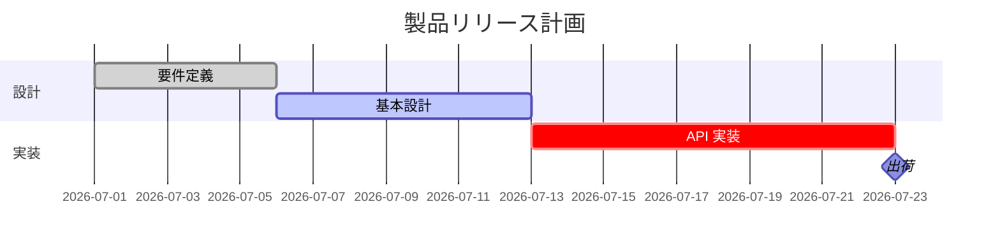
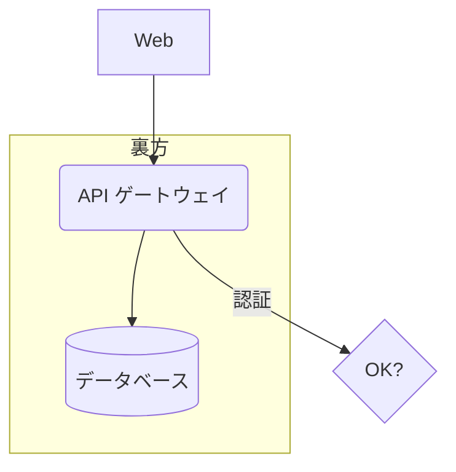
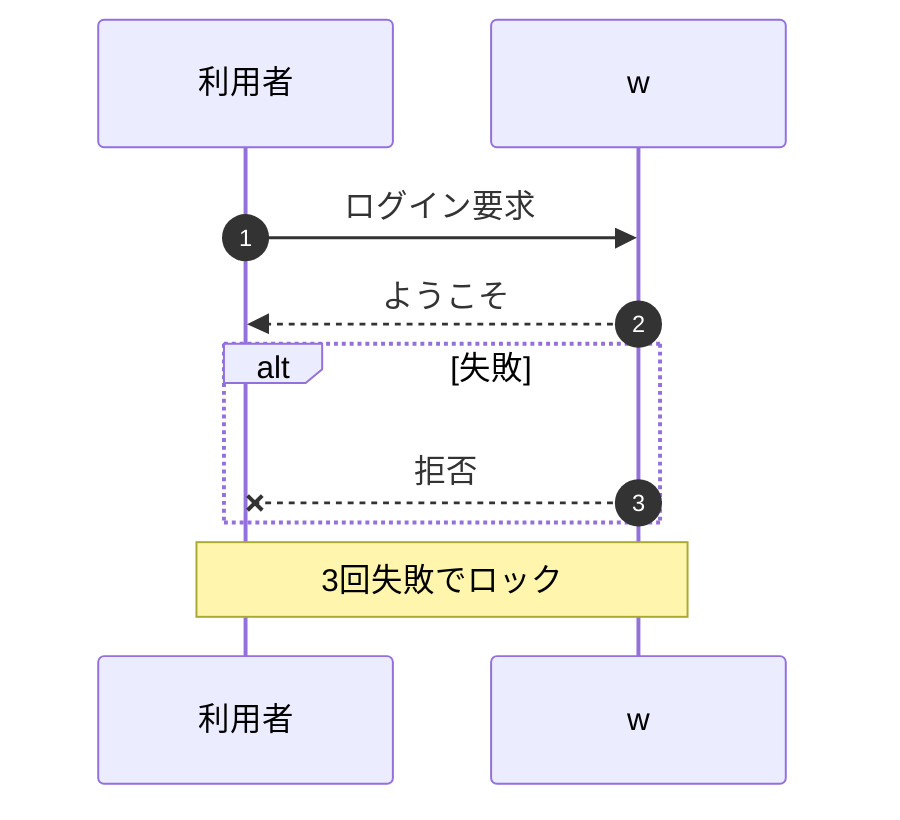

<div align="center">

# `studio`

### Mermaid で書けて、グリグリ動かせる — 作図エディタ

ガントチャート・機能構成図（フローチャート）・シーケンス図。**書けば図に、図を動かせば書き戻る。**<br>
1 図 ＝ 自己完結の単一 HTML（フル機能エディタ同梱・オフライン・どこでも開ける）。

</div>

---

## これは何

`studio` は、**今後さまざまな AI と図を育てていくための土台**です。`works/`（無から生まれた作品集）とは別に切った、実用ツールのディレクトリ。

ねらいは三つ。

1. **みんなが知っている記法** — DSL は **Mermaid 互換**（`gantt`・`flowchart`・`sequenceDiagram`）。人も AI も、すでに知っている書き方でそのまま書ける。
2. **グリグリ動かせる** — ブラウザでノードや棒をドラッグして整える。Mermaid は自動整列だけだが、studio は**手で置いた位置を保持**する。
3. **AI に優しい往復** — ドラッグの結果は Mermaid の**コメント `%% @layout`** にだけ書き戻る。意味部（何があり、何に依存するか）は汚れないので、**次の AI が差分をきれいに読める**。しかも `%%` はコメントなので、**本物の Mermaid でもそのまま描ける**。

> この作品は **依存ゼロ規則の対象外**。とはいえ「ドラッグ位置の保持」と「オフライン単一 HTML」を守るため、描画エンジンは自前（決定的・DOM 非依存）にしてあります。Mermaid 記法の認識・編集体験・出力に力を注いでいます。

## リッチなエディタ

`studio/index.html` を開くと、フル機能のエディタが立ち上がります。

- **構文ハイライト**（キーワード・タグ・日付・矢印・コメントを色分け）と**行番号**
- **リアルタイム検証** — 書いた先から解析し、おかしい行を行番号とともに指摘
- **オートコンプリート** — キーワード・タスク id・ノード id を文脈で補完（↑↓・Enter）
- **ライブ・ドラッグ可能プレビュー** — ホイールでズーム、空きをドラッグでパン、フィット、要素をドラッグで配置（8px スナップ）
- **スニペット挿入**（＋タスク／＋ノード／＋エッジ…）と**サンプル**切替
- **アンドゥ／リドゥ** — Ctrl+Z / Ctrl+Y。ドラッグやスニペット挿入も履歴に入る
- **エクスポート** — DSL コピー／`.mmd`／`SVG`／`PNG`（2 倍解像度）／**単一 HTML**（その図だけで動くエディタを書き出す)

### 手数が減る（ポトペタ・流し込み・リンク）

- **ポトペタ編集** — ノードを**クリックで選択**すると → ハンドルが生え、**別のノードへ引っぱるだけでエッジ**がつながる。**ダブルタップでその場リネーム**（ノード・タスク・参加者・エッジラベル）。**空きをダブルタップで新しいノード**がその場に生える（ガントはタスク、シーケンスは参加者）。すべて DSL に書き戻る
- **CSV / TSV の流し込み** — 「取り込み」に表を貼る・ファイルを選ぶ・**画面へドロップ**するだけで図に。列名は日英ゆらぎを吸収（名前/label・開始/start・期間/duration・依存/after・状態/status・区分/section・link、フローは from/to/label）。依存は **id でもラベルでも**書ける
- **ハイパーリンク** — Mermaid 純正の `click id "url"`（ガントは `click id href "url"`）でノード・タスクに **↗ バッジ**が生え、タップで開く。大きな図を**複数の単一 HTML に分割してリンクで渡り歩く**のに効く
- **スマホ** — **ピンチでズーム**、起動時は図が全画面（「コード ◧」でエディタ）、スニペットは横スクロールでいつでも

## Mermaid 記法

### ガントチャート



- 状態タグ `done` / `active` / `crit` / `milestone`、id、`after <id…>` の依存、`2026-07-01` 絶対日、`5d`/`2w`/`12h` の期間、終了日指定も可
- `section` で帯に分ける。依存は薄い矢印、週末は薄帯、`today` 線（`%% today YYYY-MM-DD` で基準日）

### フローチャート



- 向き `TD` / `LR` …、形状 `[]`(四角) `()`(丸) `([])`(スタジアム) `[()]`(円柱) `(())`(円) `{}`(菱形) `{{}}`(六角) `[[]]`(サブルーチン)
- エッジ `-->` / `---` / `-.->`(点線) / `==>`(太線)、ラベル `-->|text|`、`subgraph … end` でグループ
- 位置を書かなければ**依存の深さで自動段組み**（最長経路）。ドラッグで自由配置 → `%% pos id x y`。段の中の並びは**重心法（barycenter）で交差をほどき**、エッジは曲線で結ぶ

### シーケンス図



- `participant id as 別名`（宣言なしの登場者は自動で足される）、`autonumber` で番号
- 矢印 `->>`(実線) `-->>`(点線) `->`(線のみ) `-x`(バツ) `-)`(非同期)、`Note over/left of/right of`
- 枠 `loop` / `alt` / `opt` / `par` … と `else` / `end`
- **参加者を横ドラッグ**で並び替え → `%% order`（ライフラインごと入れ替わる）

## 使い方

```bash
cd studio
node build.js examples/release.mmd     # → dist/release.html（フル機能エディタ同梱の単一 HTML）
node build.js --all                    # examples/*.mmd をすべて
node --test tests/*.test.js            # 30 tests
```

同梱の例（ビルド済み）：[`dist/release.html`](./dist/release.html)（ガント）・[`dist/architecture.html`](./dist/architecture.html)（フロー）・[`dist/sequence.html`](./dist/sequence.html)（シーケンス）

## アーキテクチャ

```
studio/
├─ index.html · ui/editor.css        エディタの器（このページ＝アプリ）
├─ ui/editor.js                      編集体験：ハイライト・検証・補完・ズーム/パン・ドラッグ・出力
├─ engine/                           純粋コア（DOM 非依存・決定的・テスト対象）
│  ├─ date.js                        日付の道具（UTC 固定）
│  ├─ parse.js                       Mermaid（gantt/flowchart/sequence）→ モデル（意味部＋%% @layout を分離）
│  ├─ layout.js                      ガントの日程解決／フローの段組み＋交差ほどき／シーケンスの積み上げ
│  ├─ serialize.js                   モデル → Mermaid テキスト（往復の戻り。意味部を汚さない）
│  └─ import.js                      流し込み：CSV/TSV → Mermaid（日英ヘッダ吸収・link 列対応）
├─ render/draw.js                    モデル＋配置 → SVG 文字列（形状・状態色・矢印）
├─ build.js                          エディタ一式を畳んで 1 図 1 枚の単一 HTML に
├─ examples/*.mmd                    図のソース（Mermaid）
├─ dist/*.html                       ビルド済みの自己完結 HTML
└─ tests/                            parse・layout・roundtrip（node --test）
```

設計上の約束：**コア（engine/・render/draw.js）は DOM もネットワークも知らない**。同じ Mermaid からは寸分たがわず同じ図（決定的）。だから AI が書いても、結果は再現する。

---

<div align="center">

書けば図に、動かせば書き戻る。<br>
みんなの記法で、次の手がきれいな差分から続けられるように。

</div>
