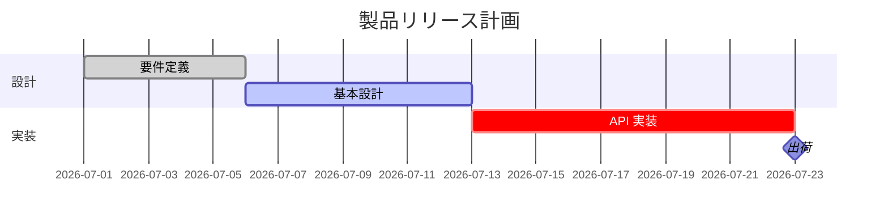
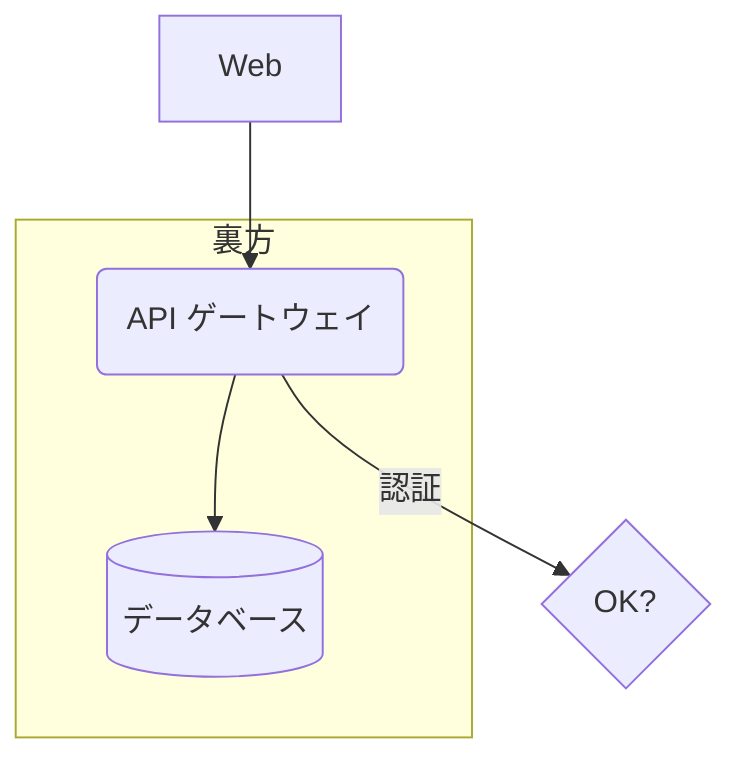
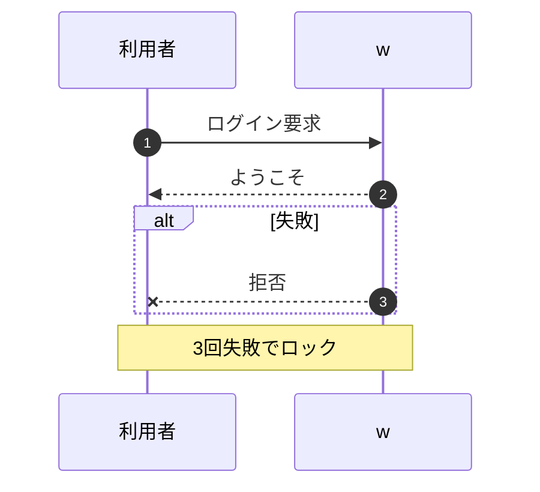
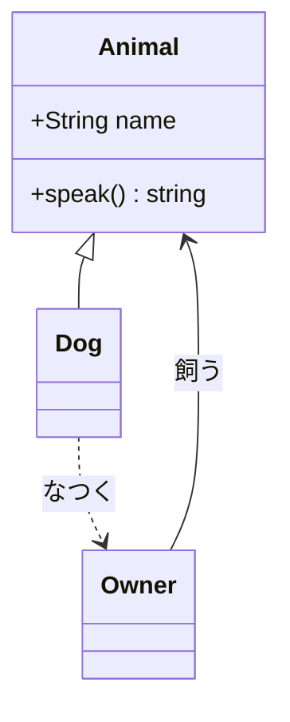

<div align="center">

# `studio`

### Mermaid で書けて、グリグリ動かせる — 作図エディタ

ガントチャート・機能構成図（フローチャート）・シーケンス図・クラス図。**書けば図に、図を動かせば書き戻る。**<br>
1 図 ＝ 自己完結の単一 HTML（フル機能エディタ＋Leaflet 同梱・どこでも開ける。オンラインなら実地図の上に）。

</div>

---

## これは何

`studio` は、**今後さまざまな AI と図を育てていくための土台**です。`works/`（無から生まれた作品集）とは別に切った、実用ツールのディレクトリ。

ねらいは三つ。

1. **みんなが知っている記法** — DSL は **Mermaid 互換**（`gantt`・`flowchart`・`sequenceDiagram`・`classDiagram`）。人も AI も、すでに知っている書き方でそのまま書ける。
2. **グリグリ動かせる** — ブラウザでノードや棒をドラッグして整える。Mermaid は自動整列だけだが、studio は**手で置いた位置を保持**する。
3. **AI に優しい往復** — ドラッグの結果は Mermaid の**コメント `%% @layout`** にだけ書き戻る。意味部（何があり、何に依存するか）は汚れないので、**次の AI が差分をきれいに読める**。しかも `%%` はコメントなので、**本物の Mermaid でもそのまま描ける**。

> この作品は **依存ゼロ規則の対象外**（リミッター解除済み）。描画エンジンは「決定的・DOM 非依存・往復可能」を守るため自前のまま、**地図の心臓には Leaflet を本採用**（`vendor/leaflet/` に同梱・単一 HTML にも焼き込む）。オンラインなら実地図タイル、オフラインでも自前ベースマップで動く。

## 投資対効果 — B/C（ベネフィット/コスト比）（v20）

v19 の障害シミュレーションを**金額**にして、BCP 投資の優先順位を出す。

- **💹 投資対効果タブ（▤ 台帳の3つ目）** — 各機器を単一障害点として評価し、**B/C の高い順**にランク：
  - **影響** ＝ その機器が落ちると本部（基準点）から到達不能になる機器の数と価値（万円/日）
  - **年損失** ＝ 故障率 × 復旧時間 × 影響（万円/年の期待損失）
  - **B/C** ＝ 年損失 ÷ 冗長化の対策費。**◎ は B/C≧1（かけた以上に返る＝投資すべき）**
  - ヘッダに現状の**年間期待損失（EAL）**とポートフォリオ B/C、CSV 出力も
- **数値は DSL で**（未指定は役割から推定、「推」バッジ表示）：`a[DB] :db, value 300, cost 60, failrate 0.2, mttr 8`（value=停止1日あたり損失 万円／cost=冗長化の年間費用 万円／failrate=回/年／mttr=時間）
- 純エンジン `engine/costben.js`（決定的）。基準点はコア級の役割を優先。**すべて概算・参考**——前提（value・failrate）は現場が入れてこそ意味を持つ。サンプル「BCP — 投資対効果（💹 B/C）」同梱

## 経路と障害 — 落として、たどる（v19）

構成図を BCP の道具に。DSL には残さない**分析の重ね描き**（右クリックから）。

- **🛣 経路をたどる** — 機器を右クリック→「経路をたどる」→ 相手をクリックで、**2 点間の最短経路が蛍光ペンで光り**、ホップ数が上部バーに出る。関係線（rep/ミラー）は通信経路に使わない。障害中の機器は自動で迂回
- **⚡ 障害シミュレーション** — 機器を右クリック→「⚡ 落とす」。落とした機器は ⚡ で暗くなり、**そこを通れないと到達できなくなる機器が赤く染まる**。「大阪DR を落としたら本社からどこが見えなくなる？」に図が即答。上部バーに「到達不能 N / 全体（％）」。**冗長が効いていれば「全機器が到達可能（冗長で救済）」**——二重化の価値がその場で分かる
- 純エンジン `engine/path.js`（BFS 最短経路・到達性、決定的）。解析は `%% コメント` にも残らない一時状態、「✕ 解析を消す」で戻る

## 初見の入口 — 最初の 30 秒で迷わない（v18）

- **ウェルカム** — 初回起動時に自動で開く 4 択：「🗾 全国メガコーポを見る」「🏭 工場 IT/OT を見る」「📋 貼り付けて作る」「✏ 白紙から書く（たたき台つき）」。下半分は**チートシート**（書く・動かす／地図と俯瞰／調べる・出す）
- **❓ ガイド** — ヘッダの ❓ からいつでも同じ画面を開ける（⌘K「ガイド」でも）。2 回目からは自動では出ない（localStorage）。単一 HTML 版は図が主役なので自動では出さない

## 編集の動線 — 右クリックで、その場でできる（v17）

- **右クリックメニュー** — 機器の上で：✎名前を変える／⧉複製／→接続を張る／ⓘ詳細／🗑削除（つながる線ごと）。ゾーンの上で：名前・畳む/開く・中身ごと削除。**空きの上で**：＋ここに機器を置く、そして**地図モードなら「🗾 ここに拠点を置く（緯度, 経度）」**——クリックした場所の実座標で拠点が生える
- **Delete / Backspace で削除** — 選択した機器（複数可）を、つながる線ごと。テキスト編集中は誤爆しない
- **接続はクリック2回** — 右クリック「接続を張る」→ つなぎ先をクリックで結線（Esc で中止）。ドラッグが苦手でも張れる
- **図の上でも Ctrl+Z / Ctrl+Y** — 今まではエディタにフォーカスがある時だけだった undo/redo が、キャンバス操作の直後にも効く（バグ修正）

## 動線をやさしく — 地図の操作を一箇所に（v16）

- **🗺 地図ボタン**（ズームバー）— 押すと**地図の操作が全部そこに**：地図ON/OFF（実座標配置）・ベースマップ（なし/OSM/地理院淡色/地理院写真）・内蔵ハザード（地震/津波/火山/台風/豪雪/地政学）・実ハザードタイル（洪水/津波/高潮/土砂）。今まで ◫レイヤ の奥に埋まっていた地図設定を、目の届く一枚のパネルに集約
- **◫ レイヤは図の要素専用に純化** — 通常線・関係線・バス・フェンス・自由レイヤだけ。「図のレイヤ」と「地図」の役割がボタンで分かれて迷わない
- **🌐 タイル取得失敗バナー** — オフラインや社内プロキシで地図画像が来ないとき、**黙って真っ暗にせず理由を出す**：「地図タイルを取得できません（構成図はそのまま表示中）」。地図が出ない＝壊れた、の誤解を防ぐ
- **文脈で出し入れ** — 🗺地図・◫レイヤ・▤台帳は **infra 図種のときだけ**表示。他の図種ではツールバーを軽く保つ
- 初回に「右下『地図』でベースマップ／ハザードを切替」の一言ガイド、⌘K にも「🗺 地図パネルを開く」

## Leaflet 本採用 — 実地図の上に立つ（v15）

- **地図モードの心臓が Leaflet に**（v1.9.4 を同梱）。SVG 構成図は `L.svgOverlay` で貼る——投影が同じ Web メルカトルなので**無変換でぴったり**。慣性パン・ピンチ・滑らかなズームは本物の地図アプリの手触り。機器ドラッグ・ポトペタ・LOD・TOC ジャンプは**地図の上でもそのまま**効く
- **ベースマップ選択**（`%% basemap osm|gsi|photo`）— OSM 標準／**国土地理院 淡色**／**地理院 全国最新写真**。◫ レイヤパネルか ⌘K で切替、ダークテーマではタイルを反転して馴染ませる
- **⚠ 実ハザードタイル**（`%% hazardtiles flood|tsunami|takashio|dosha`）— **ハザードマップポータルサイト**の本物の想定区域タイル：洪水浸水想定（想定最大）・津波浸水想定・高潮浸水想定・土砂災害警戒（土石流）を半透明で重畳。**自社の拠点網の下に、公的ハザードマップがそのまま敷ける**
- Leaflet が無い/読めない環境では従来の自前ビューポート＋低ポリ日本にフォールバック。非地図の図種は今までどおり

## レイヤ・台帳・配線の意味論（v14）

- **◫ レイヤ** — 組み込み（通常線 net／関係線 rel／バス／フェンス）＋ `:layer 名前` の**自由レイヤ**を、パネルや ⌘K で見え隠れ。消灯は `%% layers off a|b` に往復（描かないだけ——意味部は無傷）
- **関係線** — `a -- b :rep`（レプリケーション）・`:ミラー`・`:同期` は**ふくらむ曲線・別色・⟳ チップ**で描かれ、ネットワーク線と見間違えない。レイヤごと消せる
- **冗長の種別でシンボルが変わる** — `:stack`（はしご付き二重線）・`:vrrp`（実線＋待機の破線）・`:lacp`（束ねの密な二重線）・`:冗長`（従来の ha 二重線）。チップにも種別が出る
- **アドレスは向いている先ごと** — `a -- b :10.0.0.1 > 10.0.0.2` で**リンク両端の実 IP**。表示は**本体でなく線の根元**、ネットワーク（バス cidr）が分かるところは**ホスト部だけ**（`.11`）、フルはホバー/ポップアップで。機器の IP は複数書ける（`ips`）
- **ディテール・ポップアップ** — シンボルをクリックすると OS・全 IP・VLAN・ゾーン・**接続先ごとのアドレス**を浮かせて表示。本体は薄く保つ
- **コード ⇄ シンボル** — エディタのカーソル行のシンボルが**ネオンでまたたく**。シンボルをクリックすればエディタも該当行へ
- **▤ 台帳** — **機器台帳**（ID・役割・OS・IP・ゾーン・接続数）と **IP アドレス台帳（IPAM）**：ネットワーク（cidr）ごとの割当・**重複 ⚠**・**次の空き（払い出し提案）**・利用率・未収容。CSV でそのまま Excel へ
- **ファイルセット** — 大きな一枚を**拠点ごとの .mmd ＋ _shared.mmd に分割**して ZIP 保存（依存ゼロの自前 ZIP）。逆に **.mmd 複数選択で結合**して開ける。分けて書き、束ねて眺める
- **🌍 実地図タイル**（`%% tiles`・オンライン時のみ）— 投影が OSM と同じ Web メルカトルなので、**実地図タイルの上に構成図がぴったり重なる**（Leaflet のスリッピーマップの心臓部だけ自前・依存ゼロ。オフライン単一 HTML では自前ベースマップのまま）
- **描画順の修正** — バスは接続線の**下**に。交差ジャンプ ⌒ と接続点がバスの上に見える（回路図の作法）

## 日本地図の上に立つ（v13）

- **🗾 地理マップ**（`%% map` + `%% geo 拠点名|緯度|経度`）— 拠点ゾーンやハブが**実座標**に立つ。ベースマップは**自前の低ポリ日本列島**（オフライン・単一 HTML でも地図が出る。外部タイル不要）。v12 のセマンティックズームと合わせると、**引けば日本地図に拠点札、寄ればラックの中身**——本物の地図アプリの体験
- **⚠ ハザードレイヤ**（`%% hazard quake|tsunami|volcano|typhoon|snow|geopol`）— 歴史地震（阪神・東日本・熊本・能登…）と想定震源域（南海トラフ・首都直下・日本海溝）、津波常襲沿岸、火山、台風常襲域、豪雪地帯、地政学（海峡チョークポイント・海底ケーブル陸揚げ・南西諸島シーレーン）を図の上に重ねる。⌘K からレイヤごとに点灯/消灯。**すべて概略・参考**——正確な防災判断は公的ハザードマップで
- **BCP 露出（目次に ⚠ 欄）** — 拠点ごとに「どのハザードに乗っているか」を自動判定（面は内外判定・点は距離）。**同じ影響域に 2 拠点以上**あれば「☢ 同時被災の候補」として列挙——本番と DR を同じ揺れの上に置いていないか、一目で分かる
- **メガコーポ・サンプル** — **1,095 機器・113 ゾーン・40 拠点**（本社 DC・大阪 DR・地域支社 6・工場 8・支店 24・クラウド・地域ハブ網）の全国網（`examples/megacorp.mmd` / ビルド済み [`dist/megacorp.html`](./dist/megacorp.html)）。v10 サンプルの約 20 倍。生成器は `tools/genmega.mjs`（決定的——乱数も時刻も使わない）。1,000 ノードでも layout+draw は 100ms 未満
- **フェンスがゾーンに寄り添う** — `zone` 内で宣言した `fence` はそのゾーンの高さ/幅に沿って立ち、ゾーンごと動き、畳めば札の中へ
- **decluttering（ラベル整理）** — 密集地帯（首都圏・近畿…）で拠点が重なったら、**重なりの小さい軸に沿って最小移動で押し離す**（決定的）。ずれた拠点は**実座標の ○ アンカーと点線リーダー**で結ぶ——地図アプリのラベル整理と同じ作法。40 拠点が畳んでも展開しても重ならないことをテストが保証

## 地図のように眺める（v12）

- **🗺 セマンティックズーム**（`%% lod`）— 地図アプリの体験を構成図に。**ズームアウトするとゾーンが札に要約され、ズームインすると詳細が戻る**。遠景＝ゾーン札だけ／中景＝機器名まで（OS・IP のメタは省略）／近景＝全部。折りたたみは**描画時だけ**重ねるので、DSL の `%% fold` は一切汚れない。⌘K「🗺 地図モード」で切替
- **ハブ＆スポーク** — `hub wan[広域WAN] :vlan 1, 172.31.0.0/16` の一行で**二重円のハブ**。ゾーンにも `pos` にも縛られていない拠点（そのハブとしか繋がっていない機器）は**環状に自動配置**され、拠点を書き足すだけで星型が育つ。線は円周でトリム
- **ゾーン内バス** — `zone` の中で `bus` を宣言すると**ゾーンの幅で張られ、ゾーンごと動く**（サーバ室の SAN バスなど）。`len 300` で長さの固定も
- **展開ゾーンの自由配置** — `%% zpos ゾーン名|x|y` が畳んだ札だけでなく**展開中のゾーンにも効く**（中身ごと平行移動、明示 `pos` の機器は動かさない）。バスの位置もシステム内構成も、行で自由に書ける

## 自由配置と回路図の作法（v11）

- **ゾーン（レギオン）ごとドラッグ** — ゾーンの**見出しをつかむと中の機器ごと**動く（▾ キャレットは折りたたみ専用）。畳んだ札も自由に置ける（`%% zpos`）
- **バスの完全自由配置** — 水平/垂直バスを**両軸ドラッグ**（長さは自動のまま平行移動）。離れた機器からの接続は**肘（elbow）**でバスまで届き、範囲内にクランプ
- **⌒ ラインジャンプ**（`%% hops`）— 交差する線を小さな円弧で跨ぐ、回路図の作法。近接する交差はまとめて跨ぐ
- **● 接続点の丸点**（`%% dots`）— 接続の端点に丸点。どこに刺さっているかが一目
- どちらも ⌘K からワンタップ切替、コメントで往復（本物の Mermaid を汚さない）

## 巨大な世界と、道しるべ（v10）

- **全社グランドビュー・サンプル** — 東京本社（DC のコア/サーバファーム/DMZ・執務 2 フロア）・大阪 DR・クラウド・名古屋工場 OT（監視室＋2 ライン＋安全計装）・福岡支社を、広域 WAN と 4 本のバスで縦横に接続した **54 機器・16 ゾーン・44 接続**の一枚（`examples/enterprise.mmd` / ビルド済み [`dist/enterprise.html`](./dist/enterprise.html)）。このくらいの世界が **130 行のテキスト**で立つ
- **☰ 目次（TOC）** — 巨大な図の道しるべ。ゾーンの**ツリー**（台数つき）＋機器（役割タグつき）＋バス・フェンス。**検索**（名前・IP・OS・VLAN・役割）で絞り、**クリックでそこへ飛んで選択**、エディタも該当行へスクロール。**▾/▸ で目次から折りたたみ**もできる

## 現場の構成図に耐える（v9）

- **IT だけじゃない**：OT / 制御系の役割が一級市民——`:scada` `:plc` `:hmi` `:historian` `:ews` `:sensor` `:drive` `:robot` `:cnc` `:sis` `:rtu` `:dcs` `:gateway` `:diode`（データダイオード）。工場の Purdue モデル的な「情報LAN と制御LAN が FW とダイオード越しにつながる」図がそのまま書ける
- **ラインに識別**：`a -- b :冗長, vlan 100, ラベル`——冗長/ha/lacp は**二重線**、予備/stby は**破線**、幹線は太線、一方向は矢印（ダイオード向け）、**vlan は所属ネットワークの色とチップ**に。同じ 2 点間の複数本は自動でずらして描く（**多重ネットワーク**が読める）
- **保守分界フェンス**：`fence f1[保守分界（当社/ベンダー保守）] :v|h`——⚑ 付きの重い破線。ドラッグで境目に置く
- **ゾーンの折りたたみ**：ゾーン見出しの **▾/▸ をタップ**すると「▸ ライン1 ・ 3 台」の札に畳まれ、中の機器への線は札に付け替わる。保存先は `%% fold`（コメント）なので意味部は汚れない。大きな図はドメイン単位で畳んで俯瞰する
- **無限キャンバス**：viewBox が中身の bbox を常に追いかける。**どこへドラッグしても切れない**（上端の余白も確保）
- **左ペインは畳める**：「◧ コード」で図に全画面を譲る。境界ドラッグ・既定幅復帰と併せて描画エリアが主役

## システム構成図を、行で書く（v8）

studio の拡張図種 **`infra`**——Mermaid には無い、インフラ屋のための一枚。既存ツールは「箱を並べ、線を引き、属性を書く」を全部人間がやるが、ここでは**知っていることを行で書くだけ**：

```
infra
    title 本社ネットワーク構成
    zone 本社ビル {
      zone サーバ室 {
        core[CORE-SW] :core, NX-OS10
        app1[業務APサーバ] :server, RHEL9, 10.0.10.21
      }
      sw3f[SW-3F] :access, IOS15.9, vlan 30
    }
    bus lan[基幹LAN] :h, vlan 10, 10.0.10.0/24
    core -- lan
    app1 -- lan
    sw3f -- core
```

- **zone { … }** — 建屋・フロア・部署・ドメイン・DR サイト。**入れ子可**。枠は中身に合わせて膨らみ、ドラッグにも追従
- **:役割, OS, IP, vlan N** — 役割（core/access/switch/router/firewall/server/db/storage/pc/ap/lb/cloud…の**ゆらぎを吸収**）は色と CORE/FW/SV タグに、OS・IP・VLAN はカードの中に。役割でも IP でも VLAN でもない言葉は OS/バージョン扱いで**捨てずに書く**
- **bus :h|v, vlan, CIDR** — **水平/垂直の基幹バス**。VLAN・ネットワークアドレスのチップ付き。機器から `-- バス名` と書けば垂線が落ちる
- 配置は自動（ゾーン内で折り返し）。ドラッグすれば `%% pos` に保存。接続先の打ち間違い・zone の閉じ忘れ・id 重複は**その場で指摘**

さらに v8 では：**ペイン境界のドラッグ**（左は 80〜100 字相当が既定・ダブルクリックで戻る・記憶される）、**ライト/ダークテーマ**（`%% theme light` — アプリの顔ごと切り替わる）、**背景色**（`%% bg #fff` — SVG/PNG の書き出しにも焼かれるのでメール貼付に強い）、**SQL 取り込み**（CREATE TABLE を貼ると PK/FK 印字つきのクラス図＝簡易 ER に）。

## 鼻ほじりながら、なんでも（v7）

**片手で・考えた瞬間に・怖がらずに**、を合言葉にした体験の層。

- **⌘K コマンドパレット** — Ctrl+K / ⌘K（またはツールバーの ⌘K）で、**全部の操作がひとつの検索窓**から。挿入・エクスポート・サンプル・表示切替・手描き・差分・タイムトラベル…。そして打った言葉がコマンドに無ければ **「その名前のノードを追加」** に化ける——考えたらもう出来てる。白紙から打てば図ごと生える
- **万能ペースト** — 貼れば図になる。Mermaid・CSV/TSV に加えて、**箇条書き**（字下げ＝親子のツリーに）、**矢印テキスト**（`受付 -> 審査 -> 承認` の束）、**JSON**（構造ツリーに）。判定は保守的で、ただの文章は乗っ取らない
- **✏ 手描きモード** — ワンタップで図全体が**手描き風**（決定的な揺らぎ＋手書き系フォント）。保存先は `%% style sketch`——コメントなので本物の Mermaid でもそのまま描ける。描画エンジンを自前で持つ専用ツールだからできる顔
- **⏪ タイムトラベル** — 履歴を**スライダでさかのぼる**。図を見ながら「この辺が良かった」まで滑って戻れる、目で見る undo
- **差分ビュー** — 旧版の Mermaid を貼ると、**何が増え（緑）・消え（バーに一覧）・変わったか（琥珀）**を図の上に重ねる。テキスト diff でなく**モデル diff** なので並び替えや空白は差にならない。**AI が返してきた版のレビューが一目**——studio の存在理由そのもの

## リッチなエディタ

`studio/index.html` を開くと、フル機能のエディタが立ち上がります。

- **構文ハイライト**（キーワード・タグ・日付・矢印・コメントを色分け）と**行番号**
- **リアルタイム検証** — 書いた先から解析し、おかしい行を行番号とともに指摘
- **オートコンプリート** — キーワード・タスク id・ノード id を文脈で補完（↑↓・Enter）
- **ライブ・ドラッグ可能プレビュー** — ホイールでズーム、空きをドラッグでパン、フィット、要素をドラッグで配置（8px スナップ）
- **スニペット挿入**（＋タスク／＋ノード／＋エッジ…）と**サンプル**切替
- **アンドゥ／リドゥ** — Ctrl+Z / Ctrl+Y。ドラッグやスニペット挿入も履歴に入る
- **エクスポート** — DSL コピー／`.mmd`／`SVG`／`PNG`（2 倍解像度）／**単一 HTML**（その図だけで動くエディタを書き出す）

### 他のツールへ持ち出す（オートシェイプ・draw.io・画像）

- **`.drawio` を保存／draw.io XML をコピー** — ただの絵ではなく**編集できる図形**で持ち出す。ノードは対応するオートシェイプ（角丸・菱形・円柱・六角…）、フロー/クラスの**エッジはノードに接続済み**（draw.io で動かしてもついてくる）、クラスは swimlane＋stackLayout の**純正 UML クラス**。ガント・シーケンスも棒/ライフライン/矢印の図形として編集可能
- **SVG をコピー** — クリップボードに `image/svg+xml` で載せるので、**PowerPoint に貼って「図形に変換」すればオートシェイプ**として編集できる。**PNG をコピー**はそのまま貼れる画像
- **画像（スクショ）の埋め込み** — 画像を**貼り付け（Ctrl+V）またはドロップ**すると、選択中ノードに付く（未選択なら新しい画像ノードが生える）。保存先は `%% img id dataURL` ——コメントなので**本物の Mermaid でもそのまま描ける**。draw.io 出力にも image シェイプとして写る

### 手数が減る（ポトペタ・流し込み・リンク）

- **ポトペタ編集** — ノードを**クリックで選択**すると → ハンドルが生え、**別のノードへ引っぱるだけでエッジ**がつながる。**Shift+クリックで複数選択**：まとめてドラッグでき、**整列バー**（左揃え・上揃え・横/縦等間隔）が出る。**ダブルタップでその場リネーム**（ノード・タスク・参加者・エッジラベル）。**空きをダブルタップで新しいノード**がその場に生える（ガントはタスク、シーケンスは参加者）。すべて DSL に書き戻る
- **CSV / TSV の流し込み** — 「取り込み」に表を貼る・ファイルを選ぶ・**画面へドロップ**、あるいは**エディタの外で Ctrl+V**（Excel の範囲コピーがそのまま入る）だけで図に。列名は日英ゆらぎを吸収（名前/label・開始/start・期間/duration・依存/after・状態/status・区分/section・link、フローは from/to/label）。依存は **id でもラベルでも**書ける
- **ハイパーリンク** — Mermaid 純正の `click id "url"`（ガントは `click id href "url"`）でノード・タスクに **↗ バッジ**が生え、タップで開く。大きな図を**複数の単一 HTML に分割してリンクで渡り歩く**のに効く
- **スマホ** — **ピンチでズーム**、起動時は図が全画面（「コード ◧」でエディタ）、スニペットは横スクロールでいつでも

## Mermaid 記法

### ガントチャート


```mermaid
gantt
    title 製品リリース計画
    dateFormat YYYY-MM-DD
    section 設計
      要件定義 :done, req, 2026-07-01, 5d
      基本設計 :active, design, after req, 7d
    section 実装
      API 実装 :crit, api, after design, 10d
      出荷     :milestone, ship, after api, 0d
```

- 状態タグ `done` / `active` / `crit` / `milestone`、id、`after <id…>` の依存、`2026-07-01` 絶対日、`5d`/`2w`/`12h` の期間、終了日指定も可
- `section` で帯に分ける。依存は薄い矢印、週末は薄帯、`today` 線（`%% today YYYY-MM-DD` で基準日）

### フローチャート


```mermaid
flowchart TD
    web[Web] --> gw(API ゲートウェイ)
    gw -->|認証| auth{OK?}
    gw --> db[(データベース)]
    subgraph 裏方
      gw
      db
    end
```

- 向き `TD` / `LR` …、形状 `[]`(四角) `()`(丸) `([])`(スタジアム) `[()]`(円柱) `(())`(円) `{}`(菱形) `{{}}`(六角) `[[]]`(サブルーチン)
- エッジ `-->` / `---` / `-.->`(点線) / `==>`(太線)、ラベル `-->|text|`、`subgraph … end` でグループ
- 位置を書かなければ**依存の深さで自動段組み**（最長経路）。ドラッグで自由配置 → `%% pos id x y`。段の中の並びは**重心法（barycenter）で交差をほどき**、エッジは曲線で結ぶ
- `subgraph` は**入れ子**にできる（親の枠が子の枠ごと包み、往復でも保たれる）

### シーケンス図


```mermaid
sequenceDiagram
    autonumber
    participant u as 利用者
    u->>w: ログイン要求
    w-->>u: ようこそ
    alt 失敗
      w--xu: 拒否
    end
    Note over u,w: 3回失敗でロック
```

- `participant id as 別名`（宣言なしの登場者は自動で足される）、`autonumber` で番号
- 矢印 `->>`(実線) `-->>`(点線) `->`(線のみ) `-x`(バツ) `-)`(非同期)、`Note over/left of/right of`
- 枠 `loop` / `alt` / `opt` / `par` … と `else` / `end`
- **参加者を横ドラッグ**で並び替え → `%% order`（ライフラインごと入れ替わる）

### クラス図


```mermaid
classDiagram
    class Animal {
      +String name
      +speak() string
    }
    Animal <|-- Dog
    Owner --> Animal : 飼う
    Dog ..> Owner : なつく
```

- `class 名 { … }` ブロック（`()` があればメソッド区画、なければ属性区画）と一行メンバ `A : +int age`
- 関係：`<|--`(継承・三角) `*--`(合成・黒菱形) `o--`(集約・白菱形) `-->`(関連) `..>`(点線の依存)——左右どちら書きでも同じ意味に畳む
- 継承は**親が上**に段組み。ドラッグ自由配置 → `%% pos`。**ダブルタップの改名は id ごと**（関係の参照もまとめて書き換わる）

## 使い方

```bash
cd studio
node build.js examples/release.mmd     # → dist/release.html（フル機能エディタ同梱の単一 HTML）
node build.js --all                    # examples/*.mmd をすべて
node --test tests/*.test.js            # 119 tests
```

同梱の例（ビルド済み）：[`dist/release.html`](./dist/release.html)（ガント）・[`dist/architecture.html`](./dist/architecture.html)（フロー）・[`dist/sequence.html`](./dist/sequence.html)（シーケンス）・[`dist/class.html`](./dist/class.html)（クラス）

## アーキテクチャ

```
studio/
├─ index.html · ui/editor.css        エディタの器（このページ＝アプリ）
├─ ui/editor.js                      編集体験：ハイライト・検証・補完・ズーム/パン・ドラッグ・出力
├─ engine/                           純粋コア（DOM 非依存・決定的・テスト対象）
│  ├─ date.js                        日付の道具（UTC 固定）
│  ├─ parse.js                       Mermaid（gantt/flowchart/sequence/class）→ モデル（意味部＋%% @layout を分離）
│  ├─ layout.js                      ガントの日程解決／フローの段組み＋交差ほどき／シーケンスの積み上げ
│  ├─ serialize.js                   モデル → Mermaid テキスト（往復の戻り。意味部を汚さない）
│  ├─ import.js                      流し込み：CSV/TSV・箇条書き・矢印テキスト・JSON → Mermaid（万能ペースト）
│  ├─ infra.js                       システム構成図：zone/bus/役割/OS/IP/VLAN の parse・layout・draw・serialize 一式
│  ├─ diff.js                        モデル diff：旧版 → 新版の「増えた・消えた・変わった」（並び替えは差にしない）
│  └─ drawio.js                      持ち出し：モデル＋レイアウト → draw.io（mxGraph XML・編集できる図形）
├─ render/draw.js                    モデル＋配置 → SVG 文字列（形状・状態色・矢印）
├─ build.js                          エディタ一式を畳んで 1 図 1 枚の単一 HTML に
├─ examples/*.mmd                    図のソース（Mermaid）
├─ dist/*.html                       ビルド済みの自己完結 HTML
└─ tests/                            parse・layout・roundtrip（node --test）
```

設計上の約束：**コア（engine/・render/draw.js）は DOM もネットワークも知らない**。同じ Mermaid からは寸分たがわず同じ図（決定的）。だから AI が書いても、結果は再現する。

---

<div align="center">

書けば図に、動かせば書き戻る。<br>
みんなの記法で、次の手がきれいな差分から続けられるように。

</div>
