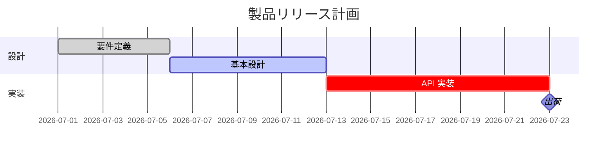
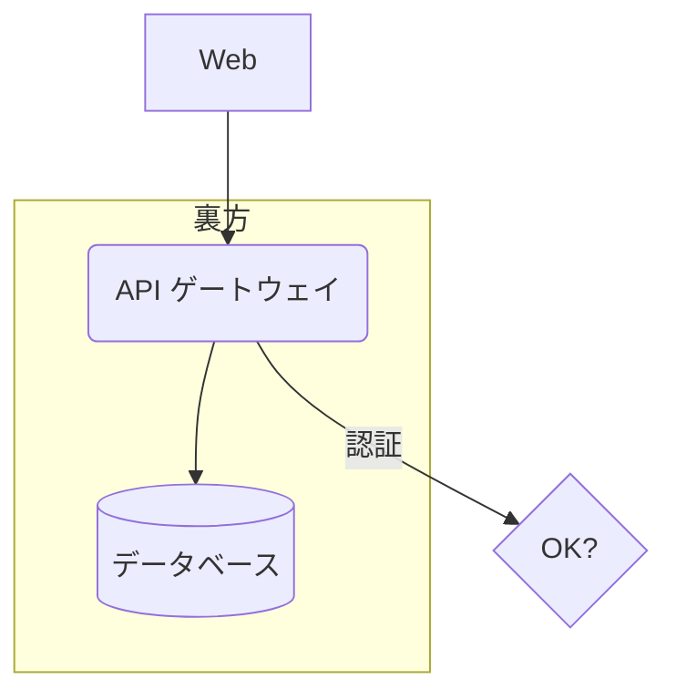
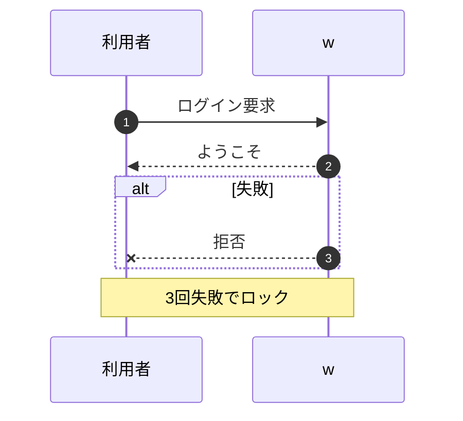
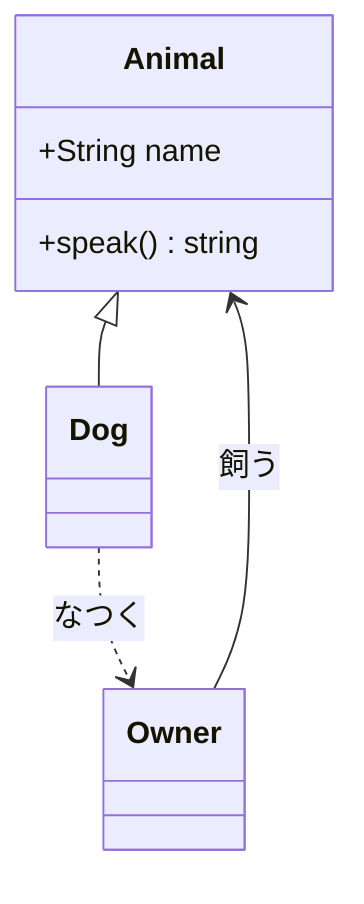

<div align="center">

# `studio`

### Mermaid で書けて、グリグリ動かせる — 作図エディタ

ガントチャート・機能構成図（フローチャート）・シーケンス図・クラス図。**書けば図に、図を動かせば書き戻る。**<br>
1 図 ＝ 自己完結の単一 HTML（フル機能エディタ同梱・オフライン・どこでも開ける）。

</div>

---

## これは何

`studio` は、**今後さまざまな AI と図を育てていくための土台**です。`works/`（無から生まれた作品集）とは別に切った、実用ツールのディレクトリ。

ねらいは三つ。

1. **みんなが知っている記法** — DSL は **Mermaid 互換**（`gantt`・`flowchart`・`sequenceDiagram`・`classDiagram`）。人も AI も、すでに知っている書き方でそのまま書ける。
2. **グリグリ動かせる** — ブラウザでノードや棒をドラッグして整える。Mermaid は自動整列だけだが、studio は**手で置いた位置を保持**する。
3. **AI に優しい往復** — ドラッグの結果は Mermaid の**コメント `%% @layout`** にだけ書き戻る。意味部（何があり、何に依存するか）は汚れないので、**次の AI が差分をきれいに読める**。しかも `%%` はコメントなので、**本物の Mermaid でもそのまま描ける**。

> この作品は **依存ゼロ規則の対象外**。とはいえ「ドラッグ位置の保持」と「オフライン単一 HTML」を守るため、描画エンジンは自前（決定的・DOM 非依存）にしてあります。Mermaid 記法の認識・編集体験・出力に力を注いでいます。

## システム構成図を、行で書く（v8）

studio の拡張図種 **`infra`**——Mermaid には無い、インフラ屋のための一枚。既存ツールは「箱を並べ、線を引き、属性を書く」を全部人間がやるが、ここでは**知っていることを行で書くだけ**：

```
infra
    title 本社ネットワーク構成
    zone 本社ビル {
      zone サーバ室 {
        core[CORE-SW] :core, NX-OS10
        app1[業務APサーバ] :server, RHEL9, 10.0.10.21
      }
      sw3f[SW-3F] :access, IOS15.9, vlan 30
    }
    bus lan[基幹LAN] :h, vlan 10, 10.0.10.0/24
    core -- lan
    app1 -- lan
    sw3f -- core
```

- **zone { … }** — 建屋・フロア・部署・ドメイン・DR サイト。**入れ子可**。枠は中身に合わせて膨らみ、ドラッグにも追従
- **:役割, OS, IP, vlan N** — 役割（core/access/switch/router/firewall/server/db/storage/pc/ap/lb/cloud…の**ゆらぎを吸収**）は色と CORE/FW/SV タグに、OS・IP・VLAN はカードの中に。役割でも IP でも VLAN でもない言葉は OS/バージョン扱いで**捨てずに書く**
- **bus :h|v, vlan, CIDR** — **水平/垂直の基幹バス**。VLAN・ネットワークアドレスのチップ付き。機器から `-- バス名` と書けば垂線が落ちる
- 配置は自動（ゾーン内で折り返し）。ドラッグすれば `%% pos` に保存。接続先の打ち間違い・zone の閉じ忘れ・id 重複は**その場で指摘**

さらに v8 では：**ペイン境界のドラッグ**（左は 80〜100 字相当が既定・ダブルクリックで戻る・記憶される）、**ライト/ダークテーマ**（`%% theme light` — アプリの顔ごと切り替わる）、**背景色**（`%% bg #fff` — SVG/PNG の書き出しにも焼かれるのでメール貼付に強い）、**SQL 取り込み**（CREATE TABLE を貼ると PK/FK 印字つきのクラス図＝簡易 ER に）。

## 鼻ほじりながら、なんでも（v7）

**片手で・考えた瞬間に・怖がらずに**、を合言葉にした体験の層。

- **⌘K コマンドパレット** — Ctrl+K / ⌘K（またはツールバーの ⌘K）で、**全部の操作がひとつの検索窓**から。挿入・エクスポート・サンプル・表示切替・手描き・差分・タイムトラベル…。そして打った言葉がコマンドに無ければ **「その名前のノードを追加」** に化ける——考えたらもう出来てる。白紙から打てば図ごと生える
- **万能ペースト** — 貼れば図になる。Mermaid・CSV/TSV に加えて、**箇条書き**（字下げ＝親子のツリーに）、**矢印テキスト**（`受付 -> 審査 -> 承認` の束）、**JSON**（構造ツリーに）。判定は保守的で、ただの文章は乗っ取らない
- **✏ 手描きモード** — ワンタップで図全体が**手描き風**（決定的な揺らぎ＋手書き系フォント）。保存先は `%% style sketch`——コメントなので本物の Mermaid でもそのまま描ける。描画エンジンを自前で持つ専用ツールだからできる顔
- **⏪ タイムトラベル** — 履歴を**スライダでさかのぼる**。図を見ながら「この辺が良かった」まで滑って戻れる、目で見る undo
- **差分ビュー** — 旧版の Mermaid を貼ると、**何が増え（緑）・消え（バーに一覧）・変わったか（琥珀）**を図の上に重ねる。テキスト diff でなく**モデル diff** なので並び替えや空白は差にならない。**AI が返してきた版のレビューが一目**——studio の存在理由そのもの

## リッチなエディタ

`studio/index.html` を開くと、フル機能のエディタが立ち上がります。

- **構文ハイライト**（キーワード・タグ・日付・矢印・コメントを色分け）と**行番号**
- **リアルタイム検証** — 書いた先から解析し、おかしい行を行番号とともに指摘
- **オートコンプリート** — キーワード・タスク id・ノード id を文脈で補完（↑↓・Enter）
- **ライブ・ドラッグ可能プレビュー** — ホイールでズーム、空きをドラッグでパン、フィット、要素をドラッグで配置（8px スナップ）
- **スニペット挿入**（＋タスク／＋ノード／＋エッジ…）と**サンプル**切替
- **アンドゥ／リドゥ** — Ctrl+Z / Ctrl+Y。ドラッグやスニペット挿入も履歴に入る
- **エクスポート** — DSL コピー／`.mmd`／`SVG`／`PNG`（2 倍解像度）／**単一 HTML**（その図だけで動くエディタを書き出す）

### 他のツールへ持ち出す（オートシェイプ・draw.io・画像）

- **`.drawio` を保存／draw.io XML をコピー** — ただの絵ではなく**編集できる図形**で持ち出す。ノードは対応するオートシェイプ（角丸・菱形・円柱・六角…）、フロー/クラスの**エッジはノードに接続済み**（draw.io で動かしてもついてくる）、クラスは swimlane＋stackLayout の**純正 UML クラス**。ガント・シーケンスも棒/ライフライン/矢印の図形として編集可能
- **SVG をコピー** — クリップボードに `image/svg+xml` で載せるので、**PowerPoint に貼って「図形に変換」すればオートシェイプ**として編集できる。**PNG をコピー**はそのまま貼れる画像
- **画像（スクショ）の埋め込み** — 画像を**貼り付け（Ctrl+V）またはドロップ**すると、選択中ノードに付く（未選択なら新しい画像ノードが生える）。保存先は `%% img id dataURL` ——コメントなので**本物の Mermaid でもそのまま描ける**。draw.io 出力にも image シェイプとして写る

### 手数が減る（ポトペタ・流し込み・リンク）

- **ポトペタ編集** — ノードを**クリックで選択**すると → ハンドルが生え、**別のノードへ引っぱるだけでエッジ**がつながる。**Shift+クリックで複数選択**：まとめてドラッグでき、**整列バー**（左揃え・上揃え・横/縦等間隔）が出る。**ダブルタップでその場リネーム**（ノード・タスク・参加者・エッジラベル）。**空きをダブルタップで新しいノード**がその場に生える（ガントはタスク、シーケンスは参加者）。すべて DSL に書き戻る
- **CSV / TSV の流し込み** — 「取り込み」に表を貼る・ファイルを選ぶ・**画面へドロップ**、あるいは**エディタの外で Ctrl+V**（Excel の範囲コピーがそのまま入る）だけで図に。列名は日英ゆらぎを吸収（名前/label・開始/start・期間/duration・依存/after・状態/status・区分/section・link、フローは from/to/label）。依存は **id でもラベルでも**書ける
- **ハイパーリンク** — Mermaid 純正の `click id "url"`（ガントは `click id href "url"`）でノード・タスクに **↗ バッジ**が生え、タップで開く。大きな図を**複数の単一 HTML に分割してリンクで渡り歩く**のに効く
- **スマホ** — **ピンチでズーム**、起動時は図が全画面（「コード ◧」でエディタ）、スニペットは横スクロールでいつでも

## Mermaid 記法

### ガントチャート


```mermaid
gantt
    title 製品リリース計画
    dateFormat YYYY-MM-DD
    section 設計
      要件定義 :done, req, 2026-07-01, 5d
      基本設計 :active, design, after req, 7d
    section 実装
      API 実装 :crit, api, after design, 10d
      出荷     :milestone, ship, after api, 0d
```

- 状態タグ `done` / `active` / `crit` / `milestone`、id、`after <id…>` の依存、`2026-07-01` 絶対日、`5d`/`2w`/`12h` の期間、終了日指定も可
- `section` で帯に分ける。依存は薄い矢印、週末は薄帯、`today` 線（`%% today YYYY-MM-DD` で基準日）

### フローチャート


```mermaid
flowchart TD
    web[Web] --> gw(API ゲートウェイ)
    gw -->|認証| auth{OK?}
    gw --> db[(データベース)]
    subgraph 裏方
      gw
      db
    end
```

- 向き `TD` / `LR` …、形状 `[]`(四角) `()`(丸) `([])`(スタジアム) `[()]`(円柱) `(())`(円) `{}`(菱形) `{{}}`(六角) `[[]]`(サブルーチン)
- エッジ `-->` / `---` / `-.->`(点線) / `==>`(太線)、ラベル `-->|text|`、`subgraph … end` でグループ
- 位置を書かなければ**依存の深さで自動段組み**（最長経路）。ドラッグで自由配置 → `%% pos id x y`。段の中の並びは**重心法（barycenter）で交差をほどき**、エッジは曲線で結ぶ
- `subgraph` は**入れ子**にできる（親の枠が子の枠ごと包み、往復でも保たれる）

### シーケンス図


```mermaid
sequenceDiagram
    autonumber
    participant u as 利用者
    u->>w: ログイン要求
    w-->>u: ようこそ
    alt 失敗
      w--xu: 拒否
    end
    Note over u,w: 3回失敗でロック
```

- `participant id as 別名`（宣言なしの登場者は自動で足される）、`autonumber` で番号
- 矢印 `->>`(実線) `-->>`(点線) `->`(線のみ) `-x`(バツ) `-)`(非同期)、`Note over/left of/right of`
- 枠 `loop` / `alt` / `opt` / `par` … と `else` / `end`
- **参加者を横ドラッグ**で並び替え → `%% order`（ライフラインごと入れ替わる）

### クラス図


```mermaid
classDiagram
    class Animal {
      +String name
      +speak() string
    }
    Animal <|-- Dog
    Owner --> Animal : 飼う
    Dog ..> Owner : なつく
```

- `class 名 { … }` ブロック（`()` があればメソッド区画、なければ属性区画）と一行メンバ `A : +int age`
- 関係：`<|--`(継承・三角) `*--`(合成・黒菱形) `o--`(集約・白菱形) `-->`(関連) `..>`(点線の依存)——左右どちら書きでも同じ意味に畳む
- 継承は**親が上**に段組み。ドラッグ自由配置 → `%% pos`。**ダブルタップの改名は id ごと**（関係の参照もまとめて書き換わる）

## 使い方

```bash
cd studio
node build.js examples/release.mmd     # → dist/release.html（フル機能エディタ同梱の単一 HTML）
node build.js --all                    # examples/*.mmd をすべて
node --test tests/*.test.js            # 64 tests
```

同梱の例（ビルド済み）：[`dist/release.html`](./dist/release.html)（ガント）・[`dist/architecture.html`](./dist/architecture.html)（フロー）・[`dist/sequence.html`](./dist/sequence.html)（シーケンス）・[`dist/class.html`](./dist/class.html)（クラス）

## アーキテクチャ

```
studio/
├─ index.html · ui/editor.css        エディタの器（このページ＝アプリ）
├─ ui/editor.js                      編集体験：ハイライト・検証・補完・ズーム/パン・ドラッグ・出力
├─ engine/                           純粋コア（DOM 非依存・決定的・テスト対象）
│  ├─ date.js                        日付の道具（UTC 固定）
│  ├─ parse.js                       Mermaid（gantt/flowchart/sequence/class）→ モデル（意味部＋%% @layout を分離）
│  ├─ layout.js                      ガントの日程解決／フローの段組み＋交差ほどき／シーケンスの積み上げ
│  ├─ serialize.js                   モデル → Mermaid テキスト（往復の戻り。意味部を汚さない）
│  ├─ import.js                      流し込み：CSV/TSV・箇条書き・矢印テキスト・JSON → Mermaid（万能ペースト）
│  ├─ infra.js                       システム構成図：zone/bus/役割/OS/IP/VLAN の parse・layout・draw・serialize 一式
│  ├─ diff.js                        モデル diff：旧版 → 新版の「増えた・消えた・変わった」（並び替えは差にしない）
│  └─ drawio.js                      持ち出し：モデル＋レイアウト → draw.io（mxGraph XML・編集できる図形）
├─ render/draw.js                    モデル＋配置 → SVG 文字列（形状・状態色・矢印）
├─ build.js                          エディタ一式を畳んで 1 図 1 枚の単一 HTML に
├─ examples/*.mmd                    図のソース（Mermaid）
├─ dist/*.html                       ビルド済みの自己完結 HTML
└─ tests/                            parse・layout・roundtrip（node --test）
```

設計上の約束：**コア（engine/・render/draw.js）は DOM もネットワークも知らない**。同じ Mermaid からは寸分たがわず同じ図（決定的）。だから AI が書いても、結果は再現する。

---

<div align="center">

書けば図に、動かせば書き戻る。<br>
みんなの記法で、次の手がきれいな差分から続けられるように。

</div>
