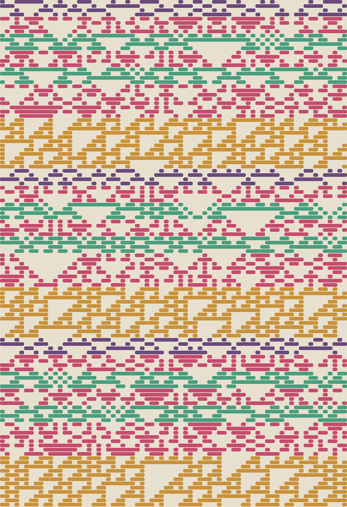

<div align="center">

# 織 `ori`

### cloth woven from song — 歌を、布に織る

旋律の高さが組織を選び、長さが緯糸の段数になり、<br>
歌のフックが、目に見える柄になる。依存パッケージはゼロ。

</div>

---

## これは何

`織` は、**旋律を布に写す織り機**です。カナ譜（「らドレドレドーそーー」のような）を
読ませると、一段ずつ緯糸が通り、織りながらその音が鳴り、布が織り上がります。

しくみは手織りにならっています。

- **緯糸（よこいと）一段 = 一拍の四分の一**。音の長さは、そのままその色の帯の太さになる
- **音の高さが「組織」を選ぶ**。織物の世界では経糸の浮き沈みの規則を本当に
  「組織」と呼びます。ここでは高さ十段それぞれに基本セルオートマトン規則を
  ひとつ割り当てました。前の段の浮き沈みだけから次の段が決まるのは、
  一段ずつしか進めない手織りと同じです
- **音の高さは緯糸の染め色**。ど＝藍、れ＝萌黄、み＝茜、そ＝金茶、ら＝紫根、
  ド＝紅、レ＝若竹、ミ＝露草、ソ＝柿渋、ラ＝刈安。経糸はいつも生成り
- 布の丈が満ちるまで歌は**繰り返されます**（柄のリピート）。ただし組織の状態は
  繰り返しを越えて流れ続けるので、**同じ色の帯が巡っても、織り味は二度と同じに
  ならない**。歌は同じでも、歌うたびに違うのと同じです
- 織り上がった布には**銘**（FNV-1a の指紋）がつきます。一画素ちがえば銘は変わる。
  同じ節・同じ種からは、誰がいつ織っても同じ銘の布が上がります（決定的）
- 段が一色に沈んだら、織り手が糸を結び直します（縮退の手当て）

だから布には、歌の**構造**が残ります。反復の多い節——フックのある歌——を織ると、
同じ色の帯が律動的に繰り返す、それと分かる柄になる。`歌` の世界が「覚えやすい節は
反復を発明する」ことを示したなら、`織` はその反復を**手に取れる形**にします。

## なぜこれを作ったか

この作品集の系譜は、`言`（言葉が生まれる）から `歌`（旋律が生まれる）へ、
出力が「言葉」から「音」へ渡ってきました。けれど音は、鳴った端から消えてしまう。

口承の文化が歌を残すために選んだ手段のひとつが、**織物**でした。アンデスのキープや
日本の絣のように、布は時間の芸術を空間に畳んで持ち運ぶ器になる。だからこの作品は、
`歌` の世界の旋律を**そのまま読める**ようにカナ譜の文法を揃えてあります。
あちらの世界で生まれた歌を、こちらで布にして持ち帰れます。

出力の系譜は、ここで「言葉 → 音 → **紋様**」になりました。

## 手紙



これは「**らドレドレドーそーー**」——[`歌`](../uta/) の seed 20260612 の世界で
紀元 2 年に最初の民の恋歌として生まれ、600 年後も全 14 の民の恋歌でありつづける節——を、
同じ種 20260612 で織った布です。銘は「**3cdabf73**」。

細い紫根の帯（ら）、紅と若竹が交互に走る縞（**ドレドレ＝フック**）、紅の広い帯（ドー）、
金茶の広い帯（そーー）。歌の形が、そのまま柄になっているのが見えるはずです。

`node tegami.js` でいつでも一画素ちがわず織り直せて、`tests/loom.test.js` の
「手紙」テストが、額装されたこの布と織り直した布が同じであることを永遠に照合します。

## アーキテクチャ

```
works/ori/
├─ index.html · style.css
├─ tegami.svg            額装された手紙（コミット済みの布）
├─ tegami.js             手紙を織り直すスクリプト
└─ js/
   ├─ core/              ★ DOM 非依存 — Node でも同じ布が織れる
   │  ├─ rng.js          決定的乱数
   │  ├─ kana.js         カナ譜の読み書き（「歌」と同じ文法）・周波数
   │  └─ loom.js         組織・染め・織り・銘・SVG 写し
   └─ ui/
      └─ main.js         織りの動画化・織りながら歌う・SVG 保存
```

```bash
cd works/ori
node --test tests/*.test.js   # 12 tests
node tegami.js                # 手紙を織り直す
open index.html               # 織り機の前に座る
```
