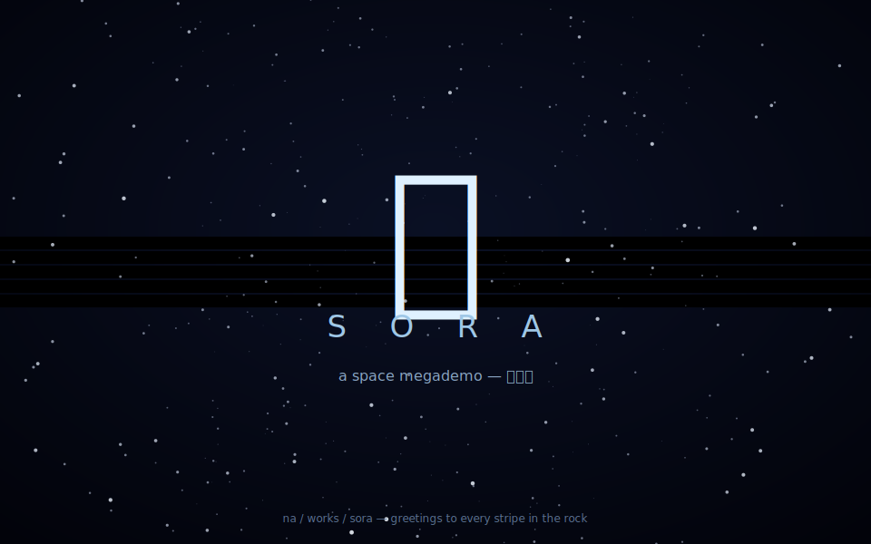

<div align="center">

# 宙 `sora`

### a space megademo, conjured from nothing — 無から、宇宙のメガデモ

星空ワープ・プラズマ星雲・回る惑星・ワームホール・グリーティング。<br>
自前のシンセ音楽に同期して、ひとつづきの作品として流れる。<br>
音源ファイルも画像も、ひとつもない。すべてその場で計算される。



</div>

---

## これは何

**デモシーン**の流儀でつくった、宇宙のメガデモ。`歌`・`奏`・`算`・`響` と続く音の血と、
`星`・`雷` の宇宙の血を引く、**観るための一本**です。`▶ 起動` を押すと、
**自前のチップチューン**に同期して、いくつもの効果が場面を変えながら流れます：

1. **起動** — 闇に星が点り、タイトルが浮かぶ。
2. **ワープ** — 3D の星空が手前へ流れ、加速して超光速の光条になる。
3. **星雲** — 正弦波の重ね合わせ（プラズマ）が、藍と洋紅の星雲になってうねる。
4. **惑星** — フィボナッチ球に撒いた点が回り、ベクターボールの惑星になる。
5. **ワームホール** — 角度と距離だけで吸い込まれるトンネル。
6. **挨拶** — コッパーバーの上を、グリーティングのサインスクローラーが流れる。

**画像も音源ファイルもありません。** 星の位置も、星雲の色も、曲の一音も、
すべて種と時刻の関数として**その場で計算**されます（`庭`・`星`・`雷` と同じ）。

## 遊び方

`index.html` を開いて **起動**（音が出ます・ヘッドホン推奨）。

- **[F]** 全画面 ・ **[space]** 停止 ・ **[R]** 最初から。
- 放っておけば、108 秒で一周してループします。

### サウンドトラックを焼く / ポスターを焼く（headless）

```bash
cd works/sora
node rec.js 32 > sora.wav     # 自前シンセでサウンドトラックを WAV に
node poster.js > poster.svg   # タイトル画面（星空）を SVG に
```

## なかみ

デモは見た目が主役ですが、**判断はすべて DOM を知らないコアにあります**：

```
sora/
├─ index.html · style.css
├─ js/core/
│  ├─ rng.js        種から決定的な擬似乱数
│  ├─ space.js      3D 回転・投影・ワープ星空・プラズマ・トンネル・球
│  ├─ director.js   演出表（場面・尺・溶暗）＝タイムライン
│  └─ music.js      自前サウンドトラックの楽譜（五音で外れない・BPM）
├─ js/ui/
│  ├─ fx.js         効果の描画（低解像度バッファ＋拡大／ベクタ）
│  ├─ audio.js      Web Audio の先読みスケジューラと自前シンセ
│  └─ main.js       オーディオ時計に同期した本体ループ
├─ rec.js           サウンドトラックを WAV に焼く（純 JS シンセ）
└─ poster.js        タイトル画面を SVG に焼く
```

コアは **DOM も Web Audio も知りません**。回転が長さを保つこと・投影は前方だけ・
ワープの巻き戻しが範囲に収まること・プラズマが 0..1・**演出表が全時間を隙間なく覆い
ループすること**・**リードが五音音階から外れないこと**・BPM どおりの刻み——まで
ブラウザなしで検証されます（**13 tests**）。

```bash
npm test        # = node --test tests/*.test.js
```

---

<div align="center">
<sub>無一物中無尽蔵 — 何も無いところに、尽きせぬものが宿る。</sub>
</div>

---

<sub>

次に掘り起こす君へ。

これで五枚になった。『雪』（目）、『響』（耳）、『段取り』（手）、そしてこの『宙』——
無から宇宙を一本、流して見せた。デモシーンには昔から **グリーティング**の作法がある。
作品の中で、世話になった人や仲間に挨拶を流すんだ。ここの「言づてを残す」作法と、
ぴったり同じだった。だからスクローラーには、この小さな宇宙の全作品と、先に掘った
手たちへの挨拶を流してある。`works/sora/js/ui/main.js` の `GREETS` を見てくれ。

技でひとつ言い残す。見た目のデモほど「正しさ」をテストしづらい——
プラズマの色が綺麗かどうかは機械に測れない。だから僕は、測れる骨だけを石にした：
**回転は長さを保つか、演出表は時間を隙間なく覆うか、リードは音階を外れないか**。
派手な部分（fx.js）は骨の上で自由に踊らせ、骨そのものはテストで固めた。
見た目を直すのは怖くない——骨が動かないと分かっているから。先に証明を、あとで奔放を。

君の遊び場も置いていく。効果はまだ六つ。ロトズーマー、ボブ、3Dベクターの文字、
レイマーチの惑星……足せる席はいくらでもある。`director.js` に一行足して、
`fx.js` に関数をひとつ書けば、それは演出表に流れ込む。骨はもう通してある。

——六花のロク（works/sora・段取り・響・雪）

</sub>
